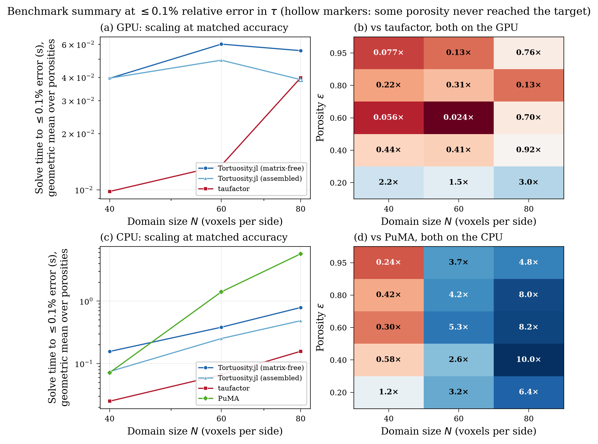
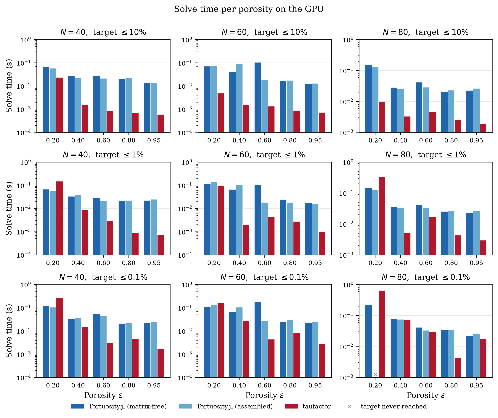
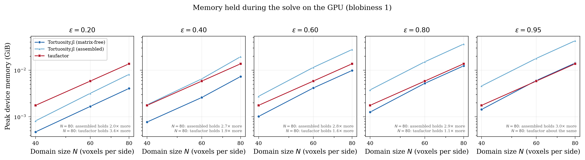
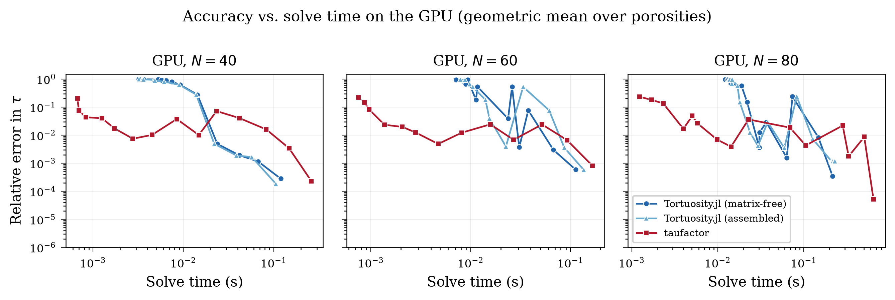
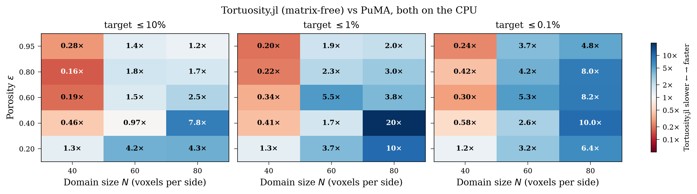

# Performance Benchmarks

This page compares `Tortuosity.jl` against two established image-based tortuosity tools:

- [taufactor](https://github.com/tldr-group/taufactor) — Python/PyTorch, successive over-relaxation (SOR) on the full image grid, GPU-capable.
- [PuMA](https://github.com/nasa/puma) — C++ with Python bindings (`pumapy`), conjugate gradient on the full grid, CPU-only (OpenMP).

## Setup

All three tools read the same images, generated once by the `Imaginator` submodule and saved to HDF5:

| Parameter   | Values                     |
|-------------|----------------------------|
| Domain size | 200, 400, 600 (800 for memory) |
| Porosity    | 0.2, 0.4, 0.6, 0.8, 0.95   |

The grid starts at 200³ because 100³ is no longer representative of the images these tools are pointed at in practice.

**800³ is measured for memory only.** Every accuracy figure here is stated against a `Float64` CPU reference, and at 800³ one of those costs hours per image — more than the entire rest of the benchmark. Memory does not need a reference: what each operator costs to hold, and whether it fits on the card at all, can be answered without knowing the right answer. That size is therefore covered by a separate fixed-iteration probe (`probe_memory_800.jl`) rather than by the accuracy sweep.

### Matched-accuracy protocol

The three tools' convergence parameters measure different quantities:

| Tool           | Solver                              | Convergence parameter                   |
|----------------|-------------------------------------|-----------------------------------------|
| Tortuosity.jl  | Conjugate gradient via LinearSolve.jl | `reltol` — algebraic residual norm     |
| taufactor      | Successive over-relaxation          | `conv_crit` — flux uniformity across slices |
| PuMA           | Conjugate gradient                  | `tolerance` — solver residual           |

Setting all three to a common value does **not** produce comparable accuracy, so a single-tolerance comparison measures the choice of parameter rather than the solver.

Instead we trace each tool's own **accuracy–time frontier** and compare the frontiers. We report the wall time of the *fastest run that reaches a given relative error in* ``\tau``, resolved at three targets — 10%, 1% and 0.1% — because the ranking depends on which one you ask for. The sweep is adaptive: it runs from coarse to fine and stops once the tightest target is met, so easy images do not waste time on needlessly tight settings while hard images still get enough resolution in the curve.

The knob is chosen to sample the frontier well, not to make the knobs numerically equal across tools:

| Tool | Knob | Range |
|------|------|-------|
| Tortuosity.jl | CG iteration count | 18 log-spaced, 1 → 20 000 |
| taufactor | SOR iteration count | 18 log-spaced, 1 → 20 000 |
| PuMA | `tolerance` | 15 log-spaced, 0.5 → 1e-7 |

!!! note "Why `Tortuosity.jl` is also swept by iteration count"
    `reltol` samples CG's frontier poorly at both ends. The loosest rungs all return ``\tau \approx 0`` (100% error) because CG barely iterates, while the tight end can step straight past the accuracy target — at ``N = 400``, ε ≈ 0.18 the ladder jumps from 1.8e-2 to 8.6e-5 in a single rung, so the frontier is never sampled near the target that decides the comparison. Capping the iteration count instead (with `reltol` set to 1e-12 so the cap is the sole stopping rule) traces the curve evenly, and it means both GPU tools are sampled the same way.

### Solver configuration

`Tortuosity.jl` is benchmarked in the configuration its own `solve(sim)` selects for images this size: the **matrix-free operator** with the **two-level preconditioner**. Building the coarse space is inside the timed region, because it is a cost paid on every solve; only work that taufactor's `Solver` constructor also does — assembly and the initial field — sits outside.

The earlier assembled, unpreconditioned path is retained as an explicit baseline and is reported separately below, so the contribution of those two features can be read off rather than assumed.

!!! note "Why taufactor is swept by iteration count rather than `conv_crit`"
    taufactor evaluates `conv_crit` only every 100 iterations (`self.iter % 100 == 0`), and convergence additionally requires the change in ``\tau`` *between consecutive checks* to be small. The loosest answer it can possibly return is therefore already 100 SOR sweeps deep, which on these images lands near 1e-4 relative error — the entire coarse-accuracy regime is unreachable through that knob, leaving its frontier truncated while `Tortuosity.jl`'s spans from 100% error downward.

    Sweeping the iteration count changes only *where the result is read off*, not how taufactor iterates, and it is **generous** to taufactor: it may now stop earlier than `conv_crit` would ever have permitted, so its measured time-to-target can only improve. The fork adds one thing to make this possible — upstream assigns `self.tau` only inside the convergence check, so a run capped below 100 iterations would report a stale value; the fork finalises ``\tau`` from the field when a run stops between checks.

Each configuration is run 3 times and the **median wall time** is reported, covering the solve only — image I/O and system assembly are excluded. Julia's compilation latency is removed by a warm-up solve on a separate small (50³) image, exercising the same operator, device and preconditioner the timed run uses; no benchmark image is ever solved twice to warm a path.

Alongside time, each row records **peak memory**: device bytes on GPU, live heap on CPU, read at the instant the solve completes and before the operator, workspace or preconditioner are released. Conjugate gradient allocates its workspace up front and reuses it, so that moment is the high-water mark. It is deliberately a single reading rather than a sampling monitor, which would need a spare thread to be scheduled during the measured region and would perturb the timings being measured.

### Reference solution

Ground truth is a `Tortuosity.jl` **CPU** solve in `Float64` at `reltol = 1e-10`. Relative error is ``|\tau - \tau_\text{ref}| / \tau_\text{ref}``.

!!! note "Why the reference is not computed on the GPU"
    GPU solves run in `Float32`, whose machine epsilon (≈ 1.2e-7) falls inside the tolerance range being swept. A `Float32` reference therefore could not resolve the errors it is meant to measure — measured against a `Float64` reference, a `Float32` GPU reference carries up to 1.7e-4 of its own error, which is larger than several of the accuracy figures it would be used to validate.

!!! note "Why `reltol = 1e-10` specifically"
    `reltol` bounds the *residual*, not the error. For conjugate gradient the solution error is bounded by ``\kappa(A) \cdot \texttt{reltol}``, and a 3D Laplacian on an ``N^3`` grid has ``\kappa \sim N^2``. At ``N = 400`` that is ``\kappa \approx 1.6\times10^5``, so a reference at `reltol = 1e-8` would admit a worst-case solution error near 1.6e-3 — *larger* than the 0.1% target it exists to certify. At `1e-10` the bound sits near 1.6e-5, roughly two orders below the target. This is also why the reference is by far the most expensive step in the benchmark: on the largest domains it costs more than the entire tolerance sweep it supports.

### Matching the discretization

The tools do not discretize the same problem by default. `Tortuosity.jl` and PuMA pin Dirichlet values at the boundary voxels themselves (node-centered, domain length ``(N-1)\Delta x``); released taufactor places the boundaries half a voxel outside the domain and divides by ``N \Delta x``. That is an ``O(1/N)`` discrepancy — 1% at ``N = 100`` — that would otherwise be attributed to the solver.

The benchmark therefore uses a [13-line fork of taufactor](https://github.com/ma-sadeghi/taufactor/commit/d05aa2e) that adopts node-centered boundary conditions, corrects the domain length accordingly, and honours the user-supplied `conv_crit` (upstream gates convergence on a hard-coded `2e-3` stability check that overrides it, which makes a tolerance sweep impossible). **No solver logic is changed.** See [`benchmarks/README.md`](https://github.com/ma-sadeghi/Tortuosity.jl/tree/main/benchmarks) for the full diff and rationale.

### Hardware

| Component | Specification                                              |
|-----------|------------------------------------------------------------|
| GPU       | NVIDIA RTX PRO 5000 Blackwell Generation Laptop, 24 GB      |
| CPU       | Intel Core Ultra 7 265HX, 20 cores                         |
| Memory    | 128 GB                                                     |
| Software  | Windows 11, Julia 1.12.6, PyTorch 2.11.0 (CUDA 12.8), pumapy 3.2.2 |

## Results

### Summary



The comparison against taufactor is **not a uniform win for either tool** — it is a regime structure organized by porosity. At the 0.1% target `Tortuosity.jl` is faster in 13 of the 15 cells, with a geometric mean advantage of 5.8×.

| Porosity | ``N=200`` | ``N=400`` | ``N=600`` |
|----------|-----------|-----------|-----------|
| ε ≈ 0.20 | **76×**   | **240×**  | **143×**  |
| ε ≈ 0.40 | **6.25×** | **11×**   | **15×**   |
| ε ≈ 0.60 | **2.51×** | **7.09×** | **6.12×** |
| ε ≈ 0.80 | **1.41×** | **2.99×** | **2.64×** |
| ε ≈ 0.95 | 0.19×     | 0.52×     | **1.00×** |

Speedup of `Tortuosity.jl` (GPU, matrix-free with the two-level preconditioner) over taufactor (GPU); above 1× we are faster.

Two things are worth reading off this table beyond the headline. First, the margin is set by how much solid there is to exclude and falls monotonically with porosity — the ε ≈ 0.2 row is where the pore-only formulation does exactly what it is designed to do, since the linear system holds a fifth of the voxels a full-grid method must sweep. At ``N = 600``, ε ≈ 0.19 taufactor needs its entire 20,000-sweep budget and 682 s to reach the target, against 339 preconditioned CG iterations and 4.8 s.

Second, the only two cells taufactor wins are at ε ≈ 0.95, and its advantage there decays with domain size: 0.19×, 0.52×, 1.00×. By ``N = 600`` the two tools are at parity even in the regime that most favours a full-grid sweep. Across every porosity the margin at ``N = 600`` exceeds the margin at ``N = 200``, though not monotonically through ``N = 400``: at ε ≈ 0.2 it peaks at 240× and falls back to 143×. Each size is an independently generated geometry rather than a refinement of the same one, so swings of a few tens of percent between adjacent sizes reflect the image as much as the method. The porosity trend, which is monotonic at every size, is the robust structure here; the size trend is not.

### What the matrix-free operator and preconditioner are worth

The table above is measured with both enabled, because that is what `solve(sim)` selects. They contribute in quite different ways, so it is worth separating them.

**The operator buys memory, not speed.** Holding the preconditioner fixed and switching only the operator, matrix-free is **1.18×** faster end to end — a geometric mean over the grid, and roughly flat with domain size (1.15× at 200³, 1.20× at 400³ and 600³). Its *apply* is considerably faster in isolation, but a solve also pays for preconditioner setup and the coarse solve, which are common to both paths, so the advantage dilutes. What does not dilute is memory:

| Porosity | ``N=200`` | ``N=400`` | ``N=600`` |
|----------|-----------|-----------|-----------|
| ε ≈ 0.20 | 1.94×     | 2.03×     | 1.94×     |
| ε ≈ 0.40 | 2.29×     | 2.33×     | 2.27×     |
| ε ≈ 0.60 | 2.56×     | 2.59×     | 2.54×     |
| ε ≈ 0.80 | 2.72×     | 2.75×     | —         |
| ε ≈ 0.95 | 2.81×     | 2.83×     | —         |

Device memory held by the assembled operator relative to the matrix-free one, measured at a fixed iteration count by `probe_memory_800.jl`. Porosity is what sets the ratio; domain size barely moves it — each row is constant within a few percent across these three sizes. At ``N = 800`` it drops by roughly 13% (1.68× at ε ≈ 0.19), so the size independence is close but not exact.

That is what the mechanism predicts. The assembled matrix stores a handful of nonzeros per *pore* voxel; the matrix-free operator stores one ``Int32`` per *grid* voxel plus vectors tracking the pore count. At fixed porosity both scale as ``N^3``, so their ratio is fixed by the pore fraction: at low porosity the grid array is relatively expensive, at high porosity the matrix dominates. Because the reading includes Krylov workspace common to both forms, these ratios understate the difference between the operators themselves.

!!! note "Why memory is measured by a separate probe, and why ratios rather than absolutes"
    The accuracy sweep also records memory, but as `CUDA.total_memory() - CUDA.available_memory()` — CUDA.jl's *pool* footprint. The pool grows opportunistically and caches freed blocks rather than returning them, so that reading is dominated by allocator behaviour: at ``N = 200`` it sat between 1.6 and 2.7 GiB for every configuration while the real spread was 135 MB to 1.09 GB, and under pressure it saturates at the card's capacity and reports the same number for everything. The probe records `CUDA.memory_stats().live` instead.

    That counter is far better behaved — it scales linearly with pore count, at about 60 bytes per pore voxel for the matrix-free operator — but it is **not** a resident-bytes measurement either. At ``N = 800``, ε ≈ 0.95 it reports 27.4 GiB on a 23.9 GiB card, while the solve completed in 17.1 s, exactly on the linear trend set by the smaller porosities. A run genuinely spilling to host memory would not keep that trend. So the counter over-reports at the extreme by some amount we have not pinned down.

    Every number in the text above is therefore a **ratio between the two operators**, measured within one script under identical conditions. Ratios are robust to a common scale error and are conservative: any workspace shared by both forms pushes a ratio toward 1. The figure plots the raw counter, so read its vertical positions as indicative and the vertical *gap* between the two curves as the result.

**The preconditioner buys speed.** Against the same package's assembled, unpreconditioned path on the identical images, the two features together are worth a geometric mean of **5.95×** and are faster in every cell where the comparison can be made. Since the operator alone accounts for 1.18×, essentially all of it is the coarse space:

| Porosity | ``N=200`` | ``N=400`` |
|----------|-----------|-----------|
| ε ≈ 0.20 | 11×       | —         |
| ε ≈ 0.40 | 7.88×     | 11×       |
| ε ≈ 0.60 | 2.58×     | 10×       |
| ε ≈ 0.80 | 3.53×     | 5.90×     |
| ε ≈ 0.95 | 2.87×     | 6.57×     |

The comparison stops at ``N = 400`` because the unpreconditioned baseline was never measured at 600³ — at roughly 3000 iterations per solve it would have cost hours for a "before" picture the iteration-count table above already conveys. The blank at ``N = 400``, ε ≈ 0.20 is not a missing measurement: the unpreconditioned path never reached 0.1% there at any tolerance, while the preconditioned one reaches it in 0.47 s.

The gain rises with ``N``, which is the point: unpreconditioned Krylov iteration counts on a 3D Laplacian grow with the linear dimension of the image, and the coarse space is what flattens them. The dash at ``N = 400``, ε ≈ 0.18 is not a missing measurement — the unpreconditioned path never reached 0.1% there at any tolerance, while the preconditioned one reaches it in 0.47 s.

### Does a linear initial guess help?

taufactor's remaining advantage at ε ≈ 0.95 comes largely from its initial guess: `init_field` seeds SOR with an exact linear concentration profile, which for a nearly open medium is already within 0.1% of the answer, while `Tortuosity.jl` starts CG from a zero vector. We measured whether giving CG the same start closes the gap.

It does not. The coarse-accuracy regime improves dramatically — at ``N = 100``, ε ≈ 0.80 the *first* iteration drops from 99% error to 1.4% — but the time to reach 0.1% is statistically unchanged: faster in 5 of 15 comparable cases, slower in 4, with a median of 1.0× at every porosity. At low porosity it is actively harmful, because forming the residual ``b - Au_0`` costs `Float32` precision and several cases then fail to reach the target at all.

The reason is physical: a linear profile is a good guess only when the medium is nearly open. At ε ≈ 0.2, where ``\tau \approx 11``, the true field looks nothing like a straight line. This is why the warm start is available in the benchmark (`--warm-start`) but is not the package default.

!!! note "Measured on the unpreconditioned path"
    The warm-start experiment predates the two-level preconditioner and was run without it; the two cannot currently be combined in the harness, because the warm start rewrites the right-hand side and so bypasses the `solve(sim, ...)` entry point that attaches a preconditioner. The conclusion — that a linear profile is the wrong shape at low porosity — is geometric and does not depend on the preconditioner, but the 1.0× median has not been re-measured against it.

### How much the answer depends on the accuracy you ask for

Reporting a single accuracy target flatters whichever solver happens to suit it. Resolving the same data at 10%, 1% and 0.1% shows that the ranking **inverts** across that range:

| target | cells where `Tortuosity.jl` is faster | geometric mean speedup |
|--------|----------------------------------------|------------------------|
| 10%    | 4 of 15                                | 0.46× |
| 1%     | 9 of 15                                | 1.84× |
| 0.1%   | 13 of 15                               | 5.84× |

(GPU, all three domain sizes, against taufactor.)

Both ends have a mechanism. taufactor's SOR starts from a linear concentration profile, which for an open medium is already close to the answer, so when little accuracy is demanded it has very little left to do. `Tortuosity.jl` meanwhile pays a fixed setup cost — building the coarse space — that is charged even to a solve which then runs for one iteration. As the target tightens, the initial guess stops helping and the convergence rate of the method decides the outcome, which is where a Krylov method separates from a stationary one.

The practical reading: if 10% is good enough, the choice of tool barely matters and a full-grid SOR sweep is perfectly reasonable. The case for this package is the accurate end.



Each panel is one domain size at one accuracy target, with one bar per porosity, so the spread that an aggregate would hide stays visible.

### Memory



Peak device memory for the two operator forms. This is where the matrix-free operator earns its place: it stores one `Int32` index array over the grid instead of column pointers, row indices and values, and the gap widens with the image until the assembled path stops fitting on the card at all.

At 800³ the assembled path fails in two distinct ways, and only one of them is a memory limit.

Above roughly ``3 \times 10^8`` pore voxels its 32-bit sparse indices overflow, so for ε ≳ 0.6 the operator cannot be built at all and the package refuses the problem rather than corrupting memory. That failure is immediate and explicit. Below that threshold the operator builds — at ε ≈ 0.39 its 1.4 × 10⁹ nonzeros sit comfortably inside the index range — but the solve then runs at the card's capacity and does not finish; it was stopped after ten minutes in two independent attempts. That failure is silent, and is the more awkward of the two to diagnose in practice.

The matrix-free operator completes every porosity at this size. `results/results_memory_probe.csv` records, per porosity, which operator built, whether the solve completed, what it held, and the time for a fixed 100 iterations.

### Accuracy versus time



Each curve traces one tool's ladder from loose (fast, inaccurate) to tight — iteration count for the two GPU tools, `tolerance` for PuMA. The vertical position at a given time is what the matched-accuracy protocol samples.

### Against PuMA



PuMA's conjugate-gradient solver is CPU-only, so it is compared against the `Tortuosity.jl` CPU path rather than the GPU path. Where both reach the target — three cells, all at ``N = 200`` — `Tortuosity.jl` is faster in every one:

| Porosity | `Tortuosity.jl` (CPU) | PuMA | speedup |
|----------|----------------------|------|---------|
| ε ≈ 0.60 | 5.41 s               | 156.1 s | **28.9×** |
| ε ≈ 0.80 | 3.86 s               | 106.6 s | **27.6×** |
| ε ≈ 0.95 | 7.25 s               | 30.6 s  | **4.2×**  |

Geometric mean 15.0×. The comparison is thin, and that is itself the main finding: PuMA reached 0.1% in **none** of the five images at ``N = 400``, having exhausted the per-tolerance budget first, and it was not run at ``N = 600``, where it could not have finished within any budget we could afford. Blank cells mean one or both tools never reached the target, not that the measurement is missing.

!!! note "Both paths are close to single-threaded"
    Neither tool uses the machine's 20 cores. Sampled during active solving, the `Tortuosity.jl` CPU path occupies **1.95 cores** — it is dominated by a sparse matrix–vector product that Julia executes on a single thread, with only the BLAS level-1 operations threaded — and PuMA occupies **1.30 cores**. PuMA advertises OpenMP parallelism, but the Windows `pumapy` distribution appears to fall back to its Python solver path; parts of PuMA are documented as UNIX-only. The comparison is therefore roughly core-matched, with a modest ~1.5× core advantage to `Tortuosity.jl` that should be kept in mind when reading the margins.

## Limitations

**The preconditioned GPU path is not bit-reproducible.** The two-level preconditioner accumulates its coarse operator and its restriction with atomic floating-point additions. The order in which thread blocks reach those atomics is not fixed between launches, so the summation is non-associative from one run to the next and the same image at the same tolerance does not return exactly the same ``\tau``.

This was quantified by a standalone experiment, separate from the benchmark sweeps: five repeats of the same solve at a fixed `reltol = 1e-6`, on the ε ≈ 0.2 geometries, which are the most ill-conditioned in the set (``\tau \approx 10``–15). It spans ``N = 100`` to ``400`` because those were the sizes available when it was run; the conclusion is about the preconditioner, not about any particular grid.

| | ``N=100`` | ``N=200`` | ``N=300`` | ``N=400`` |
|---|---|---|---|---|
| two-level | 0.008% | 0.019% | 0.035% | 0.094% |
| unpreconditioned | 0.000% | 0.000% | 0.000% | 0.000% |

Spread is ``(\max \tau - \min \tau) / \text{median}\,\tau``. Two things follow. The unpreconditioned GPU path is *exactly* reproducible under the same test, so this is a property of the preconditioner's atomics and not of `Float32` arithmetic in general. And at ``N = 400`` the spread is the same order as the 0.1% accuracy target itself, so whether such an image "reaches" the target is partly luck. The harness therefore reports the **median ``\tau`` over three repeats** at every rung and records the spread in a `tau_spread` column.

The sweeps corroborate this at the converged rungs, where the spread should reflect the atomics floor rather than genuinely different iterates: across the five 600³ images the recorded spread runs from 5.5e-5 to 2.2e-4, comfortably inside the 0.1% target. An unconverged rung is a different matter — at 189 iterations on the 600³, ε ≈ 0.19 image the spread reads 1.7e-3, and reporting that number as a reproducibility figure would be a mistake.

Disable the preconditioner (`precond=:none`) or use the CPU `Float64` path when a reproducible number is needed. The CPU path shows zero spread throughout.

An earlier version of this page attributed this scatter to `Float32` precision and put it at ±0.4%. That was measured across two different sweep modes rather than repeated runs of one configuration, and it was wrong on both the magnitude and the cause.

**Both CPU paths are close to single-threaded**, as noted above.

**PuMA does not reach 0.1% at large ``N`` within the per-tolerance budget.** On the reported grid it converged in 3 of the 10 images at ``N = 200`` and ``400`` — all three at ``N = 200`` — with the rest exceeding the 150 s per-tolerance limit first. It was not attempted at ``N = 600``. This is a property of the measurement budget as much as of the solver, and it is reported rather than hidden: a larger budget would fill in more cells, at a cost we judged better spent elsewhere.

## Reproducing

The benchmark scripts, environment specification, and raw CSV results live in [`benchmarks/`](https://github.com/ma-sadeghi/Tortuosity.jl/tree/main/benchmarks). Python dependencies (PuMA, PyTorch, the taufactor fork) are pinned with [pixi](https://pixi.sh); the taufactor fork is vendored as a git submodule.

```bash
git clone --recurse-submodules https://github.com/ma-sadeghi/Tortuosity.jl.git
cd Tortuosity.jl/benchmarks

# Julia environment (Tortuosity.jl dev'd from the parent, plus CUDA and HDF5)
julia --project=. -e 'using Pkg; Pkg.instantiate()'

# Python environment
pixi install

# Generate the shared images. Append-only: sizes already present are skipped,
# so this never disturbs geometry that existing results were measured against.
julia --project=. generate_images.jl

# Ground truth first, in its own process. These are Float64 CPU solves and by
# far the most expensive step; caching them before anything else means the
# reusable half of the work is banked before the repeatable half begins.
# `-t auto` here only: a reference is a value, not a timing, so its thread count
# changes nothing. The sweeps below must stay single-threaded — see the note.
julia --project=. -t auto bench_tortuosity.jl --refs-only

# Then the four solver configurations, each its own process and its own CSV.
for dev in "--skip-cpu" "--skip-gpu"; do
  for op in "--matrixfree" ""; do
    julia --project=. bench_tortuosity.jl --sweep-iters --precond --timeout=1800 $op $dev
  done
done

# Memory, over the whole grid including 800³. Separate from the sweeps because
# it needs no ground truth and measures live bytes rather than the pool.
julia --project=. probe_memory_800.jl 200 400 600 800

pixi run python bench_taufactor.py --timeout=1800
pixi run python bench_puma.py
pixi run python plot_results.py
```

Dropping `--matrixfree --precond` reproduces the unpreconditioned assembled baseline instead, into its own set of CSVs.

Run the benchmarks **serially** — they compete for the same GPU and CPU, and running them concurrently contaminates the timings they exist to measure. Each script resumes from its CSV, so an interrupted run can be restarted without repeating completed work.

!!! warning "Run the GPU and CPU passes in separate processes"
    A process that has already run 400³ `Float64` CPU sweeps carries a multi-GB Julia heap, and GPU sweeps that follow lose their monotonicity in the tolerance — a tighter setting comes back *faster*, which is not something a solver can do. `--skip-cpu` and `--skip-gpu` exist to keep the two apart, and `--refs-only` isolates the most memory-hungry step of all.

!!! warning "Do not run the sweeps with `-t auto`"
    Julia starts single-threaded, and the CPU timings reported here were measured that way. The matrix-free apply is a KernelAbstractions kernel and would happily use all 20 cores, but PuMA occupies only ~1.30 of them during its solve. Threading our side would turn a roughly core-matched comparison into a hardware advantage presented as an algorithmic one, and would break comparability with every CPU row already recorded.

Reference values are cached in `results/references.csv` and deliberately survive `--overwrite`, which means "re-measure the timings", not "discard ground truth". At ``N = 400`` a reference costs up to hours of single-core `Float64` work. Delete that file to force recomputation.
