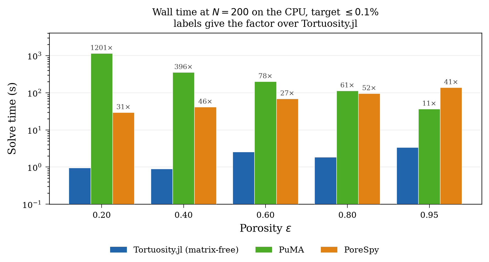

# Performance Benchmarks

This page documents the benchmark campaign that backs the performance claims in the JOSS paper. It carries the detail the paper had to cut for length: the full protocol, the patches each tool needed, the per-case numbers behind every aggregate, and the gaps in the data.

We compare `Tortuosity.jl` against three established image-based tortuosity tools:

- [taufactor](https://github.com/tldr-group/taufactor) — Python/PyTorch, successive over-relaxation (SOR) on the full image grid, CPU and GPU.
- [PuMA](https://github.com/nasa/puma) — C++ with Python bindings (`pumapy`), finite volume with SciPy's conjugate gradient on the full grid, CPU only.
- [PoreSpy](https://github.com/PMEAL/porespy) — Python, `tortuosity_fd`: the image becomes an OpenPNM cubic network over the pore voxels alone, and Fickian diffusion on it is solved by Ruge-Stuben algebraic multigrid from PyAMG. CPU only.

Every number below is traceable to a file under [`benchmarks/results/`](https://github.com/ma-sadeghi/Tortuosity.jl/tree/main/benchmarks/results). Where something is not recorded, this page says so rather than filling the gap. If you want the answer rather than the method, go straight to [Results](@ref); everything before it is protocol.

```@contents
Pages = ["benchmark.md"]
Depth = 2
```

## Setup

### The image grid

All four tools read the same images. The `Imaginator` submodule generates them once and caches them as one HDF5 file per case under `benchmarks/data/images/`. Each file carries a SHA-256 in `manifest.csv` that every stage verifies before it loads.

| axis | values |
|---|---|
| domain size ``N`` | 200, 400, 600, 800, 1000 |
| target porosity ``\varepsilon`` | 0.20, 0.40, 0.60, 0.80, 0.95 |
| blobiness | 0.5, 1.0, 2.0 |

That is 75 combinations, of which **74 are measurable**. `n1000_b050_p020` has no percolating pore space at all — `manifest.csv` records it with zero nodes — so it has no reference and never runs. The same porosity and feature size *do* percolate at ``N = 200``, so this is a finite-size effect rather than a solver failure, and any coverage count at ``1000^3`` is out of 14 rather than 15.

Blobiness is the feature-size knob: `Imaginator.blobs` blurs with ``\sigma = \text{mean(shape)}/40/\text{blobiness}``, so a higher value gives finer features and longer transport paths. Because ``\sigma`` scales with the domain, a ``200^3`` and a ``1000^3`` image at the same blobiness hold the same number of blobs, and the size sweep therefore measures scaling rather than a changing geometry. Porosity alone does not describe a porous medium: at ``N = 600``, ``\varepsilon \approx 0.19`` the coarse structure gives ``\tau = 23.4`` and the fine one ``\tau = 11.2``, a factor of two at the same pore fraction. The campaign covers three structures to show that a ranking between solvers survives that. Across the whole grid ``\tau`` runs from 1.028 to 33.93.

Every image is trimmed to the pore space that percolates along the transport axis. This is not cosmetic: an isolated pore cluster contributes nodes no boundary condition reaches, leaving the operator singular on that subspace, and solvers differ in how they cope with that. An untrimmed image would therefore measure error handling rather than transport.

### Matched-accuracy protocol

The tools' convergence parameters measure different quantities, so setting them all to a common value does not produce comparable accuracy: a single-tolerance comparison measures the choice of parameter rather than the solver.

Instead we sweep each tool over the knob that best traces *its own* accuracy–time frontier, and compare the frontiers. We report the wall time of the **fastest measured run that reaches a given relative error in ``\tau``**, at three targets — 10%, 1% and 0.1% — because the margin depends on which one you ask for. Every rung is written to the CSV, so the time to reach any looser target is answerable from the same data without re-measuring.

| tool | knob | range |
|---|---|---|
| Tortuosity.jl | CG iteration count | 18 log-spaced, 1 … 20 000 |
| taufactor | SOR iteration count | 18 log-spaced, 1 … 20 000 |
| PuMA | CG iteration count | 18 log-spaced, 1 … 20 000 |
| PoreSpy | multigrid tolerance | 18 log-spaced, 0.5 … ``10^{-10}`` |

**Iteration count rather than tolerance, wherever the solver allows one.** `knob_name` is `iters` in every row of every Krylov and SOR file in `results/timings/`, PuMA included. Tolerance samples those frontiers badly at both ends: the loosest settings return ``\tau \approx 0``, and the tightest can step straight past the target in a single rung. And taufactor evaluates its own `conv_crit` only every 100 iterations, which puts the entire coarse-accuracy regime out of reach through that knob.

!!! note "Why PoreSpy is swept on tolerance instead"
    PyAMG's multigrid takes a tolerance and returns only once it has met it, so there is no iteration cap to trace a frontier with. Tolerance is also a better knob there than it would be for the others: multigrid converges at a rate that barely changes from one rung to the next, so the rungs land evenly rather than piling up at one end. The ladder runs tighter than the shared one because PoreSpy's own default is ``10^{-8}``, and on the most tortuous images the 0.1% target is not reached until below that.

!!! note "What PuMA needed to reach the same axis"
    Two workarounds, both in `bench_puma.py`. `PropertySolver.solve` raises rather than returning a partial result when SciPy stops on `maxiter`. It also passes only `atol` to SciPy and never `tol`, which leaves that at its `1e-5` default, so every tolerance rung below ``10^{-5}\|b\|`` was a duplicate of the one above it. Driving SciPy's conjugate gradient directly, over PuMA's own operator and preconditioner, fixes both. Nothing about PuMA's algorithm changes — only the stopping rule, which is the thing being swept.

### One solve per case, not one per rung

Each iteration-swept tool's whole ladder is traced from a **single** solve. A Krylov or SOR iterate is deterministic — iterate ``k`` is the same vector whether the run stopped there or carried on — so reading tortuosity off at each rung reports exactly what one solve per rung reported, at a fraction of the cost. The time recorded against a rung has the cost of the readings taken so far subtracted back out, so it stays comparable with a plain run that stopped at that iteration.

This was verified rather than assumed, on both devices and all three iteration-swept tools: ``\tau`` comes back bit-identical at every rung, and the traced time lands within a few percent of one-solve-per-rung, converging on it as the rung grows.

This required two things. `abstol = 0` for `Tortuosity.jl`, because LinearSolve otherwise defaults it to ``\sqrt{\varepsilon_\text{machine}}`` — 3.4e-4 in `Float32` — which ends the solve long before the iteration cap and leaves most of the ladder unreachable. And a `checkpoints` argument on the vendored taufactor fork.

PoreSpy is the exception. It is swept on tolerance and so needs a solve per rung, but everything the tolerance does not change is shared: trimming, the network, the assembly and the multigrid hierarchy are built once, and their measured cost is added to every rung, which is what the tool charges a user who asks for that tolerance directly. Rebuilding them per rung would charge one fixed cost eighteen times and measure the ladder rather than the solver. That setup is the larger half of the call — 36.6 s of 68.9 s at ``200^3``, ε ≈ 0.60.

### What the clock covers

**Every tool is clocked from the moment it receives the image to the moment tortuosity can be read.** One rule, applied identically: problem construction, matrix assembly and preconditioner build are all inside the timed region, for all four. Only the image itself, and the tortuosity read-off at the end, sit outside — the first because it is the input, the second because it is instrumentation rather than work a user does.

!!! note "This replaces an earlier, less even convention"
    An earlier version of this benchmark excluded setup for taufactor and PuMA on the grounds that their users pay it before solving, and called the result conservative. It was not conservative by a small margin. taufactor's `Solver` constructor builds the SOR checkerboard from an ``N^3`` `float64` array and a three-way ``N^3`` meshgrid; measured at ``200^3`` on the GPU it cost **0.415 s against a 0.48 s solve — 45% of the total**, and it grows as ``N^3``. Charging `Tortuosity.jl` for its assembly and coarse space while charging taufactor nothing skewed the GPU comparison by about the whole margin being measured, and inverted the ranking at the loose end of the accuracy ladder.

Each rung is run three times and the **median** reported, with the spread recorded in a `tau_spread` column. A first repeat slower than `repeat_threshold_s` (60 s) abandons the remaining repeats. Those rows carry `repeats = 1` and a NaN spread, because a spread of zero is the claim that three runs agreed exactly, which is not the same thing as not having looked.

The two full-grid competitors start from a supplied initial guess — taufactor's `init_field` seeds SOR with an exact linear concentration profile — while `Tortuosity.jl`'s CG starts from a zero vector. PoreSpy is on our side of this one: it passes no `x0`, and PyAMG then starts from `np.zeros_like(b)`. For a nearly open medium that profile is already close to the answer, so taufactor begins nearly converged and we do not. The current harness has no warm-start option. An earlier experiment that gave CG the same linear start is not reproducible against this code, so its result is not reported here.

### Reference solution

Ground truth is a `Tortuosity.jl` **CPU** solve in `Float64` at `reltol = 1e-10`, computed once per image into `results/references.csv` and reused by every tool. Relative error is ``|\tau - \tau_\text{ref}| / \tau_\text{ref}``.

!!! note "Why the reference is not computed on the GPU"
    GPU solves run in `Float32`, whose machine epsilon (≈ 1.2e-7) falls inside the error range being measured, so a `Float32` reference cannot resolve the errors it is meant to certify.

!!! note "Why `reltol = 1e-10` specifically"
    `reltol` bounds the *residual*, not the error. For conjugate gradient the solution error is bounded by ``\kappa(A) \cdot \texttt{reltol}``, and a 3D Laplacian on an ``N^3`` grid has ``\kappa \sim N^2``. At ``N = 400`` that is ``\kappa \approx 1.6\times10^5``, so a reference at `reltol = 1e-8` would admit a worst-case solution error near 1.6e-3 — *larger* than the 0.1% target it exists to certify. At `1e-10` the bound sits near 1.6e-5, roughly two orders below the target.

References are the most expensive thing the campaign computes: **51.1 hours over the 74 cases**, with the largest single reference (`n1000_b200_p020`) costing 3.64 h. Each is appended the moment it is solved, so an interruption costs at most one case, and the file survives `--overwrite`, which means "re-measure the timings", not "discard ground truth".

### Matching the discretization, and the taufactor fork

The tools do not discretize the same problem by default. `Tortuosity.jl` and PuMA pin Dirichlet values at the boundary voxels themselves (node-centered, domain length ``(N-1)\Delta x``). Released taufactor places the boundaries half a voxel outside the domain and divides by ``N \Delta x``. That is an ``O(1/N)`` discrepancy — 1% at ``N = 100`` — that would otherwise be attributed to the solver.

taufactor is therefore vendored as a clone pinned at [`ma-sadeghi/taufactor@a4bc5f9`](https://github.com/ma-sadeghi/taufactor/commit/a4bc5f9), which is `v1.2.1-24-ga4bc5f9`: upstream's own history past the v1.2.1 tag, plus **two patches of ours, 13 lines and 46**. **No solver logic is changed.**

- [`d05aa2e`](https://github.com/ma-sadeghi/taufactor/commit/d05aa2e) (+13 −7) — node-centered Dirichlet BCs at voxels 1 and ``N_x`` with the SOR checkerboard zeroed on those slices; domain length ``(N_x - 1)\Delta x`` to follow; and the convergence criterion honoring the user's `conv_crit` instead of a hard-coded `2e-3` that silently overrides it.
- [`a4bc5f9`](https://github.com/ma-sadeghi/taufactor/commit/a4bc5f9) (+46 −3) — `checkpoints` and `checkpoint_hook` on `solve`, which read ``\tau`` off at a list of iteration counts without stopping and subtract the cost of the readings back out of the clock. This is what lets one solve trace the whole ladder, and it also finalizes ``\tau`` when a run stops between the every-100-iteration convergence checks, where upstream would report a stale value. It touches no state the SOR sweep reads, which is why iterate ``k`` comes back bit-identical either way.

### Memory is measured by its own stage

Memory is never read off a timing sweep. The two questions want opposite things from a run: a timing must not be perturbed and so cannot afford a sampler, while a peak needs one and does not care what it costs. The memory stage runs one short fixed-length solve (100 iterations) per case, needs no ground truth, and is cheap.

| | host | device |
|---|---|---|
| Julia | resident set, sampled on an interactive thread | `CUDA.memory_stats().live`, sampled |
| Python | resident set, sampled by `psutil` | `torch.cuda.max_memory_allocated()` |

Host memory is the process resident set in **both** languages, sampled at the same interval, and figures report the *increase* over a baseline taken with the image already loaded. Raw totals would rank runtimes rather than solvers — a Julia process starts near a gigabyte and a Python one near a tenth of that.

**The memory stage runs one process per case, and that is not a tuning choice.** A resident-set increase only means anything in a process that has not already faulted in comparable pages. Measured within one process the readings are worthless: torch's CPU allocator reuses pages it already holds, so an ``80^3`` taufactor solve holding several full-grid tensors reported 0.6 MB, and the series was not even monotonic in domain size.

!!! note "Device memory is what the solve holds, not what the allocator took"
    `CUDA.total_memory() - CUDA.available_memory()` and `torch.cuda.max_memory_reserved()` measure a caching allocator's footprint, which grows opportunistically and saturates at the card's capacity under pressure — reporting the same number for every configuration, precisely where the comparison matters most. Both are recorded for context in `pool_device_bytes` and must not be compared between configurations.

By default the memory stage covers only blobiness 1.0 (`memory.blobinesses` in `config.toml`), because memory tracks pore count, which at a fixed porosity barely moves with the structure.

### Threads

**Nothing is pinned.** Every tool takes the machine the way a user running it would — `-t auto` for Julia, torch's own pool for taufactor, whatever NumPy and SciPy size their BLAS to for PuMA — and every row records the count that run actually got. What the campaign claims is a speedup, not an algorithmic advantage, so a tool that parallelizes better is entitled to the result that follows from it, and one that does not is not protected from it.

The counts recorded in `results/environment.csv` are asymmetric, and the asymmetry is real rather than a policy:

| tool | `cpu_threads` recorded |
|---|---|
| Tortuosity.jl | 16 |
| PuMA | 16 |
| taufactor | 8 |

Julia's `-t auto` and SciPy's BLAS both take all 16 logical threads; torch sizes its default pool to the 8 physical cores. **Threads requested are not cores used**, which is why occupancy was sampled separately — see [Core occupancy](#Core-occupancy) below.

!!! note "An earlier policy pinned everything to one thread, and it was wrong in both directions"
    It forced taufactor and PuMA down to one thread while Julia's OpenBLAS quietly kept eight, and then recorded `cpu_threads = 1` for runs that were nothing of the sort. Nothing on this page was measured that way.

### Hardware and software

The whole dataset comes from one host. `results/environment.csv` records the host per batch, and every row of every result file carries it.

| | |
|---|---|
| host | `pmeal-hpc` |
| GPU | NVIDIA Quadro RTX 8000, 48 GB (the runtime reports 47.268 GiB usable) |
| CPU | 8 physical cores, 16 logical threads |
| Julia | 1.12.6 |
| Python | 3.11.15 (3.11.16 in the PoreSpy environment, which is solved separately) |
| PyTorch | 2.10.0+cu128 |
| PuMA (`pumapy`) | 3.2.2 |
| PoreSpy | 3.0.4, with OpenPNM 3.6.3 |
| taufactor | fork of v1.2.1, pinned at `a4bc5f9` |

The GPU model comes from the `accelerator` column of `environment.csv`, and the core counts from `results/core-occupancy*.json`, which record `host_physical_cores` and `host_logical_cores` directly. **The operating system, the exact CPU model and the host RAM are not recorded anywhere in `results/`.** The largest CPU run in the campaign peaked at 169.4 GB resident, so the machine has at least that much memory, but the campaign does not record the figure itself. The `torch` build recorded (`2.10.0+cu128`) is the Linux wheel from `pixi.lock`; the Windows wheel pinned in the same lockfile is 2.11.0+cu128 and was not used.

## Results

### Summary


Panels (a) and (b) are the GPU: scaling at matched accuracy, and the speedup against taufactor resolved by size and porosity. Panels (c) and (d) are the CPU. Panel (d) is bars rather than a second regime map because the two CPU-only tools were run at ``200^3`` alone, and a size-by-porosity map of one measured column is four-fifths blank — which reads as a tool that tried and failed rather than as a sweep nobody could afford. Every panel is drawn at blobiness 1.0. A hatched heatmap cell is one taufactor never reached, where its time is projected from the same per-porosity power law the scaling panels use; a cell stays blank only where `Tortuosity.jl` itself has no measurement, since a ratio between two estimates would report nothing. The CSV carries a `stop_reason` for each.

In the scaling panels a solid segment joins measurements, and a dashed segment with a hollow marker means at least one porosity there was projected rather than measured; the warning under *Against taufactor on the CPU* lists every projected value and how far each one reaches. A series stops where a porosity ran out of memory instead, since no mean over the porosities that remain covers the same images: that is why the assembled operator ends at ``600^3`` on the GPU. The legend carries the exponent of a power law fitted to the measured points, which is the comparison the panel exists for. taufactor comes to ``N^{3.3}`` on the GPU and ``N^{4.6}`` on the CPU, against ``N^{2.5}`` and ``N^{3.1}`` for the matrix-free path. Three is linear in voxel count, so ours is close to a fixed iteration count per solve while taufactor's rises with the edge length — the same effect the preconditioner section measures directly.

An exponent marked **est.** in a legend came from a scaling probe rather than from a fit, and every point on that series above its one measured size is an estimate. PuMA and PoreSpy are the two: neither was *timed* over the size grid, so their time curves rest on the one size that was measured and on an exponent measured separately, in `results/scaling-probes.csv`. Nothing about those curves is a fit through their own points, because they have only one point to fit. The next section gives the probes and what they imply. The memory figure is a different matter — both tools were probed at more than one size there, and it is marked accordingly.

### Against taufactor on the GPU

Speedup of `Tortuosity.jl` (matrix-free operator with the two-level preconditioner) over taufactor, both on the GPU, at the 0.1% target, at blobiness 1.0 — the same slice the figure draws. Above 1× we are faster.

| Porosity | ``N=200`` | ``N=400`` | ``N=600`` | ``N=800`` | ``N=1000`` |
|---|---|---|---|---|---|
| ε ≈ 0.20 | **83.9×** | **145×** | **171×** | **194×** | — |
| ε ≈ 0.40 | **5.39×** | **18.3×** | **25.9×** | **3.89×** | **33.4×** |
| ε ≈ 0.60 | **5.10×** | **10.5×** | **8.05×** | **20.6×** | **8.22×** |
| ε ≈ 0.80 | **2.20×** | **5.71×** | **6.57×** | **4.60×** | **4.58×** |
| ε ≈ 0.95 | **1.66×** | **2.29×** | **3.06×** | **3.10×** | **1.51×** |
| geometric mean | 6.09× | 13.0× | 14.8× | 11.7× | 6.60× |

The dash at ``N = 1000``, ε ≈ 0.20 is not a missing measurement: taufactor gave up after 2349.2 s at 8.61e-3 relative error, while `Tortuosity.jl` reached the target in 31.8 s. Blank cells throughout this page mean one tool never got there, never that the run was not attempted.

Pooling all three microstructures rather than one gives 70 paired cases at the 0.1% target and a **pooled geometric mean of 8.40×**, ranging from 1.34× to 194×:

| | ``N=200`` | ``N=400`` | ``N=600`` | ``N=800`` | ``N=1000`` | row |
|---|---|---|---|---|---|---|
| ε ≈ 0.20 | 45.9× | 73.5× | 89.5× | 105× | 62.9× | **70.5×** |
| ε ≈ 0.40 | 6.06× | 14.9× | 15.1× | 13.1× | 29.4× | **13.2×** |
| ε ≈ 0.60 | 3.11× | 8.06× | 10.5× | 13.8× | 14.8× | **8.83×** |
| ε ≈ 0.80 | 1.80× | 3.53× | 6.05× | 4.17× | 5.25× | **3.85×** |
| ε ≈ 0.95 | 1.60× | 2.09× | 3.16× | 3.19× | 2.34× | **2.40×** |
| column | **4.78×** | **9.18×** | **10.6×** | **10.3×** | **9.11×** | **8.40×** |

Two things in this table matter beyond the headline.

**Porosity moves the result more than size does.** The margin is set by how much solid there is to exclude and falls monotonically with porosity at every size — from 70× near ε ≈ 0.2 to 2.4× at ε ≈ 0.95. At ``N = 600``, ε ≈ 0.19 taufactor needs its entire 20 000-sweep budget and 867.9 s to reach the target, against 189 preconditioned CG iterations and 5.1 s.

**The size trend rises steeply and then plateaus; it does not keep widening.** The column means above mix a changing case set as taufactor drops out, so they overstate the trend. On a fixed set of 12 microstructure/porosity families that both tools solve at *every* size:

| | ``N=200`` | ``N=400`` | ``N=600`` | ``N=800`` | ``N=1000`` |
|---|---|---|---|---|---|
| geometric mean | 2.79× | 5.92× | 8.16× | 7.30× | 9.11× |
| worst case | 1.34× | 1.96× | 2.48× | 2.52× | 1.51× |
| best case | 15.5× | 24.5× | 46.7× | 56.7× | 62.9× |

That fixed set is a stricter subset than the pooled table, because a family has to pair at ``1000^3`` as well, which excludes the low-porosity families where the margin is largest. Both are honest; only this one supports a five-size scaling claim. The margin rises to about 8× by ``600^3`` and holds. Meanwhile the **spread keeps opening** while the mean stays flat, so the geometric mean alone hides the shape.

!!! note "Restricting to cases both tools solve biases against us"
    A speedup ratio needs both tools to have produced an answer, and the cases taufactor cannot finish are exactly the ones we win biggest. Four such cases exist at the 0.1% target and appear in no speedup figure: `n600_b050_p020` (taufactor exhausted its ladder at 868.3 s and 1.52e-3 error; ours 2.51 s), `n800_b050_p020` (2060.4 s, 1.75e-3; ours 9.31 s), `n1000_b050_p040` (timed out at 2351.8 s, 2.18e-3; ours 19.9 s) and `n1000_b100_p020` (2349.2 s, 8.61e-3; ours 31.8 s). As lower bounds those are 345×, 221×, 118× and 74×, and in each one taufactor never produced the answer at all.

    There are no cases in the other direction: `Tortuosity.jl` reaches the 0.1% target on all 74 GPU cases (`stop_reason = target_reached` in every row of `results/timings/tortuosity-gpu-matrixfree.csv`).

### How much the answer depends on the accuracy you ask for

Reporting a single accuracy target flatters whichever solver happens to suit it. Resolving the same data at three targets shows that the ranking **does not invert** — demanding more accuracy widens the margin without reversing it:

| target | paired cases | pooled geometric mean | cases taufactor wins | where |
|---|---|---|---|---|
| 10% | 74 | 5.35× | 0 | — |
| 1% | 74 | 6.45× | 0 | — |
| 0.1% | 70 | 8.40× | 0 | — |

(GPU, all five sizes, all three microstructures.) The case count drops to 70 at the tightest target because that is where taufactor's four failures land; those four are dropped from the mean rather than counted as wins.

taufactor is no longer faster in any paired case, at any of the three targets. The narrowest cell is `n200_b200_p095`, where 6 SOR sweeps and 0.381 s now lose to 59 CG iterations and 0.284 s — 1.34×. Both iteration counts are unchanged from the earlier campaign; what moved was our fixed cost per solve.

The narrow margin at ``200^3`` has a mechanism. taufactor's SOR starts from a linear concentration profile, which for an open medium is already close to the answer, so when little accuracy is demanded it has little left to do. `Tortuosity.jl` meanwhile pays a fixed setup cost — assembling the operator and building the coarse space — that is charged even to a solve which then runs for one iteration. At ``200^3`` that fixed cost is a large fraction of a sub-second solve, though the steady-pipeline work has cut it far enough to turn those cells from losses into wins. As the image grows, or the target tightens, the convergence rate of the method decides the outcome, which is where a Krylov method separates from a stationary one.


Each curve traces one tool's ladder from loose (fast, inaccurate) to tight, one panel per domain size. The vertical position at a given time is what the matched-accuracy protocol samples. The CPU equivalent is `docs/src/assets/benchmark_pareto_cpu.png`.


Each panel is one domain size at one accuracy target, with one bar per porosity, so the spread an aggregate would hide stays visible.

### Against taufactor on the CPU

Both tools also run on the CPU, where HostCG changes the balance and the sign flips only for small high-porosity cases:

| | ``N=200`` | ``N=400`` | ``N=600`` | ``N=800`` | row |
|---|---|---|---|---|---|
| ε ≈ 0.20 | 96.2× | 215× | 303× | — | **173×** |
| ε ≈ 0.40 | 6.97× | 21.1× | 32.7× | 27.4× | **19.1×** |
| ε ≈ 0.60 | 2.45× | 16.1× | 26.2× | 32.5× | **13.5×** |
| ε ≈ 0.80 | 0.69× | 4.97× | 11.7× | 6.52× | **4.03×** |
| ε ≈ 0.95 | 0.33× | 1.50× | 4.00× | 3.91× | **1.66×** |
| column | **3.26×** | **14.0×** | **21.9×** | **12.3×** | **10.3×** |

Pooled over all three microstructures, 56 paired cases, geometric mean 10.3×, ranging 0.125× to 547×. taufactor is faster in five of them, all at ``N = 200`` and ε ≥ 0.8; from ``400^3`` onward `Tortuosity.jl` is faster in every paired CPU case. See `docs/src/assets/benchmark_speedup_taufactor_cpu.png` and `docs/src/assets/benchmark_scaling_cpu.png`.

!!! warning "The taufactor CPU dataset has two gaps, and the scaling panel fills them by projection"
    There is **no taufactor CPU data at ``1000^3``**, and none at ``800^3`` for ε ≈ 0.2. The ``800^3`` cases were excluded from the sweep that ran and the follow-up never happened — a sequencing gap, not a decision. Filling it was judged not worth the machine time: the worst ``600^3`` CPU case took 6.02 h and exhausted its ladder without reaching the target.

    The tables above report measurements only, so those cells stay blank. The heatmaps and the scaling panels do not, because a mean over whichever porosities a tool happened to reach is a different quantity at every size, and biased in one direction: the porosity taufactor loses first is the densest, which is the one it is slowest on. Dropping it drew taufactor levelling off on the GPU and speeding up on the CPU, neither of which happens. Each missing cell is therefore projected from a power law fitted to that porosity's own measured sizes, and every point on those panels averages over the same five porosities.

    A power law is the right form here — cost per unknown is fixed, and both the unknown count and the sweep count are powers of the edge length — and it fits taufactor tightly, at ``R^2`` from 0.95 to 0.998 per porosity. It is also what makes the per-cell noise tolerable: which rung of a coarse ladder first crosses the target is close to arbitrary, so individual cells are not monotonic in size even where the underlying cost is.

    The projected values, at blobiness 1.0 and the 0.1% target: on the CPU ``1000^3`` comes to 3537 s at ε ≈ 0.4, 10658 s at 0.6, 3532 s at 0.8 and 1665 s at 0.95. **The two ε ≈ 0.2 projections are the weakest numbers in this document** — 27.7 h at ``800^3`` and 85.3 h at ``1000^3``, from three measured sizes and an exponent of 5.04, extrapolating two size steps rather than one. They dominate their geometric means. On the GPU only one cell is projected, ε ≈ 0.2 at ``1000^3``, at 5103 s; that case did run, reaching 0.86% error in 2349 s before it timed out, so the measurement bounds the projection from below and is consistent with it.

### Against our own CPU path

On the GPU the solver is **8.10× faster than its own HostCG CPU path**, geometric mean over all 74 cases, ranging 2.31× to 12.2×:

| | ``N=200`` | ``N=400`` | ``N=600`` | ``N=800`` | ``N=1000`` |
|---|---|---|---|---|---|
| GPU over CPU | 7.00× | 7.95× | 8.18× | 8.43× | 9.19× |

The ratio rises with size and then holds between 8× and 9×, which is what a device with a fixed launch overhead and a large bandwidth advantage should do.

### Against the CPU-only tools



PuMA's finite-volume solver and PoreSpy's `tortuosity_fd` have no GPU path, so both are compared against the `Tortuosity.jl` CPU path, and both were run at ``200^3`` and no further.

`Tortuosity.jl` is faster than both in all 15 cases at ``N = 200``: by a geometric mean of **105×** against PuMA, ranging 6.5× to 1991×, and of **34.3×** against PoreSpy, ranging 15.8× to 57.4×. At blobiness 1.0:

| Porosity | `Tortuosity.jl` (CPU) | PoreSpy | speedup | PuMA | speedup |
|---|---|---|---|---|---|
| ε ≈ 0.19 | 0.95 s | 29.2 s | **30.7×** | 1141.3 s | **1201×** |
| ε ≈ 0.40 | 0.89 s | 40.9 s | **46.1×** | 351.4 s | **396×** |
| ε ≈ 0.60 | 2.53 s | 68.6 s | **27.1×** | 198.5 s | **78.5×** |
| ε ≈ 0.80 | 1.83 s | 94.7 s | **51.7×** | 112.5 s | **61.4×** |
| ε ≈ 0.95 | 3.34 s | 137.2 s | **41.1×** | 36.3 s | **10.9×** |

The two expose different bottlenecks, which is the useful part of running both. PuMA's margin is worst on the most open image — 1201× down to 10.9× — because its conjugate gradient has the hardest system to solve where the pore space is most tortuous. PoreSpy remains 27–52× slower across the reference slice because its cost is set largely by how many pore voxels there are: the network and multigrid hierarchy are both built over the pore space before any iteration runs. So the pore-only design that PoreSpy shares with us is not by itself what produces the margin.

PoreSpy also reached the 0.1% target in all 15 cases, and its ``\tau`` at the rung it stopped on lands within 9.9e-4 of our reference everywhere, median 4.7e-4. It is the third independent code the accuracy section leans on.

**Neither tool was run above ``200^3``, by decision rather than by failure.** `results/timings/puma-cpu.csv` and `results/timings/porespy-cpu.csv` contain ``200^3`` only. That is why this comparison is drawn as bars at one size rather than as the size-by-porosity map the taufactor comparisons get: the map would be four-fifths blank, and a blank cell there reads as a tool that tried and missed, which is not what happened.

#### Scaling probes, and what the larger sizes would have cost

Neither tool is guessed at. Each was run once at ``400^3``, blobiness 1.0, beside its ``200^3`` counterpart, and the ratio of the pair is a measured exponent. The probes live in [`results/scaling-probes.csv`](https://github.com/ma-sadeghi/Tortuosity.jl/tree/main/benchmarks/results) and are what the projected curves in every figure rest on.

| tool | probe | ``400^3`` / ``200^3`` | exponent |
|---|---|---|---|
| PoreSpy | one solve to its own 1e-8 default, ε ≈ 0.18 | 902.9 s / 31.2 s = **29.0×** | ``N^{4.86}`` |
| PoreSpy | the same, ε ≈ 0.60 | 1713.6 s / 79.0 s = **21.7×** | ``N^{4.44}`` |
| PuMA | time to the 0.1% target, ε ≈ 0.60 | 2484.0 s / 198.5 s = **12.5×** | ``N^{3.65}`` |

PuMA's cost splits cleanly into the two things that make a full-grid Krylov method expensive, and the probe measures both. Its work per iteration rose 7.0× for a doubling, which is the voxel count and nothing more — at matched rungs, 0.577 s per iteration at ``200^3`` against 4.02 s at ``400^3``. What the extra factor buys is iterations: the same case met the target at 339 iterations at ``200^3`` and needed 607 at ``400^3``, so the iteration count grows with the edge length as well. Together those give ``N^{3.65}``.

PoreSpy scales worse, not better, which is the opposite of what algebraic multigrid is supposed to do: a doubling costs it 22–29× where the pore count grows only 8×, so its hierarchy is not staying mesh-independent on these pore networks. Its two probes disagree by more than PuMA's single one can be checked against, and that spread of 4.44 to 4.86 is the honest uncertainty on its curve — over the 5× span from ``200^3`` to ``1000^3`` it is a factor of 1.4 either way.

Applied to a single pass over all fifteen cases — 44.8 minutes for PoreSpy at ``200^3``, 97.9 for PuMA, with the repeats stripped out because at these sizes every case exceeds the repeat threshold and runs once:

| stage | PoreSpy | PuMA | both |
|---|---|---|---|
| ``400^3`` | 19 h (16–22) | 20 h | **~1.6 days** |
| ``600^3`` | 124 h (98–155) | 90 h | **~9 days** |

At ``600^3`` PoreSpy also stops fitting at the open end of the porosity range, so part of that stage could not be bought at any price. Both figures are wall clock on a machine that must not run anything else while it measures.

!!! warning "Which points in the figures are estimates"
    Every point either tool contributes above ``200^3`` — in the scaling panels, the per-porosity time bars and the memory bars — is projected from these probes and is drawn as an estimate: dashed line and hollow marker on a curve, hatched fill on a bar, and `est.` beside the exponent in the legend. The projections are worth having because both tools are already an order of magnitude behind at the smallest size and both scale worse than we do, so no plausible error in an exponent changes the ranking; they are not worth reading as predictions of a particular run's wall time.

    **Time and memory are estimated to different depths.** Every *timing* above ``200^3`` is projected. Memory is not: PuMA was measured at ``200^3``, ``400^3`` and ``600^3``, and PoreSpy at ``200^3`` and two ``400^3`` cases, so only ``800^3`` and ``1000^3`` are projected in the memory figure. A memory probe is affordable where a timing is not, because it solves to the loosest rung on the ladder rather than to the accuracy target — the footprint is set before the iteration count matters — which costs minutes where a timing costs hours.

### Core occupancy

The tools use the CPU very differently. Occupancy was sampled on the benchmark host with `psutil.cpu_percent` over the process tree. The external-tool run trims the first and last 20% of samples; the HostCG run uses explicit markers around the actual timed construction and solve intervals after compilation, warm-up and image loading. Checkpoint readouts, result writes, repeat bookkeeping and forced garbage collection are outside those intervals. Raw data in `results/core-occupancy.json` and `results/core-occupancy-ours.json`.

| tool | case | median cores | mean | peak | usable samples |
|---|---|---|---|---|---|
| PuMA | `n200_b100_p040` | **6.30** | 5.85 | 6.76 | 420 |
| PoreSpy | `n200_b100_p040` | **2.30** | 2.85 | 8.29 | 264 |
| Tortuosity.jl (CPU, matrix-free HostCG) | `n200_b100_p040` | **7.82** | 7.13 | 11.54 | 21 |
| Tortuosity.jl (CPU, matrix-free HostCG) | `n600_b100_p040` | **14.04** | 12.88 | 15.81 | 144 |

Of 8 physical cores (16 logical). PuMA occupies about six cores throughout its solve and PoreSpy about 2.3. HostCG uses more of the machine: 7.8 cores at ``200^3`` and 14.0 at ``600^3``, with peaks near all logical threads. The CPU margin therefore combines algorithmic work reduction with stronger host parallelism rather than coming from less hardware use.

!!! note "Why our side is sampled by a second script"
    `core-occupancy.json` covers the two external tools, sampled in one pass so that they are directly comparable. It does not cover ours: `julia` is not on the benchmark host's path inside a `pixi run` environment, and an earlier paired run that did reach it recorded `"exit": -11` — a SIGSEGV during exit cleanup, after the solve had completed and the row had been written — with only 6 usable samples. Six samples is not a measurement. The `Tortuosity.jl` figures above come from `core-occupancy-ours.json`, whose `tool` field identifies `tortuosity-cpu-matrixfree-hostcg`; it samples ten times a second at ``200^3`` and adds a ``600^3`` case where the solve dominates outright. Both scripts give their children an isolated temporary result root, so active timing and environment files are never opened; `results_mode: "isolated"` and `published_results_unchanged: true` record that invariant in each JSON. The top level records `host`, `started_at` and `completed_at`, and each sample embeds the benchmark child's runtime, version, thread count, variant and measurement timestamp.

    PoreSpy is launched through `pixi run`, because it resolves in an environment of its own, so its solve runs one level below the process the sampler starts. An occupancy sampler must therefore hold on to the child processes it discovers and reuse them: `cpu_percent` reports the share used since *that object's* previous call, so rebuilding the objects each interval makes every call a first call, and every first call returns 0.0. Before that was fixed this sampler reported a 227-second PoreSpy solve as using no CPU at all, with a clean exit code. PuMA's number is unaffected — its work happens in the process the sampler launches directly — and its current same-pass median is 6.30 cores.

### Memory


Peak device memory, blobiness 1.0, in GB. **The figure plots `results/memory/*.csv`, which is the shipped path — the `Float32` solve *plus* the `Float64` refinement pass that `solve` applies by default.** `results/archive/pre-refine-2026-08-20/` holds the same cases measured before refinement was added, and both are given here because the two answer different questions: what the operator costs, and what a user pays.

| ``N`` | | ε ≈ 0.20 | 0.40 | 0.60 | 0.80 | 0.95 | taufactor |
|---|---|---|---|---|---|---|---|
| 200 | matrix-free, solve only | 0.081 | 0.128 | 0.177 | 0.225 | 0.260 | 0.227 |
| | matrix-free, as shipped | 0.109 | 0.200 | 0.282 | 0.362 | 0.421 | |
| | assembled, as shipped | 0.225 | 0.421 | 0.600 | 0.778 | 0.829 | |
| 400 | matrix-free, solve only | 0.632 | 1.065 | 1.491 | 1.911 | 2.205 | 1.801 |
| | matrix-free, as shipped | 0.867 | 1.570 | 2.263 | 2.946 | 3.424 | |
| | assembled, as shipped | 1.285 | 2.781 | 4.269 | 5.747 | 6.789 | |
| 600 | matrix-free, solve only | 2.152 | 3.632 | 5.023 | 6.403 | 7.440 | 6.068 |
| | matrix-free, as shipped | 2.957 | 5.362 | 7.622 | 9.864 | 11.549 | |
| | assembled, as shipped | 4.431 | 9.568 | 14.426 | 19.271 | 22.934 | |
| 800 | matrix-free, solve only | 5.089 | 8.521 | 11.876 | 15.212 | 17.658 | 14.375 |
| | matrix-free, as shipped | 6.989 | 12.564 | 18.015 | 23.436 | 27.411 | |
| | assembled, as shipped | 10.500 | 22.426 | 43.855 | *oom* | *oom* | |
| 1000 | matrix-free, solve only | 9.900 | 16.660 | 23.275 | 29.788 | 34.443 | 28.057 |
| | matrix-free, as shipped | 13.586 | 24.568 | 35.316 | 45.898 | 49.660 | |
| | assembled, as shipped | 20.423 | 48.509 | *oom* | *oom* | *oom* | |

**The measured matrix-free footprint is a two-term model, and it is exact for this dataset.** Fitted by least squares on the five ``800^3`` solve-only points: **32.02 bytes per pore node plus 4.00 bytes per grid voxel**. Extrapolated to ``1000^3`` it reproduces all five measured points to within 0.013%, and the worst residual anywhere at ``N \ge 400`` is 0.09%. The two terms are the mechanism written down: 4 bytes per *voxel* is the `Int32` index map over the grid, and 32 bytes per *pore node* is the Krylov workspace and preconditioner, which both operator forms share. The later direct-readout path adds at most 8 bytes per open inlet-face voxel, an ``O(N^2)`` term that these measurements predate and that remains negligible beside the ``O(N^3)`` solve storage. (``200^3`` sits about 5% off the model, which is allocation granularity at a footprint of a few hundred megabytes.)

Refinement adds a flat **20.0 bytes per pore node**, giving 52 B/node + 4 B/voxel for the shipped path, measured at 23 of the 25 matrix-free cases. The two exceptions are the guard doing its job: at ``1000^3``, ε ≈ 0.95 it fires at the third allocation and the delta is 16 B/node, and for the assembled operator at ``1000^3``, ε ≈ 0.40 it fires at the first, leaving the peak completely unmoved.

**Operator ratios.** Over the 20 cases where both operators complete:

| basis | geometric mean | range |
|---|---|---|
| as shipped (solve + refinement) | **1.87×** | 1.48× – 2.43× |
| solve only | **2.32×** | 1.73× – 3.18× |

The two differ because refinement's 20 B/node is charged to *both* operators and is common to them, so including it pushes the ratio toward 1. Ratios are the robust quantity here: any workspace both forms share is conservative, and a common scale error cancels.

!!! note "The assembled operator's per-node cost has two regimes, and the data shows the step"
    `src/assembly.jl` picks the index type from `7 * nnodes + 1 <= typemax(Int32) ? Int32 : Int`, so the assembled operator widens its offsets to 64 bits above 306 783 378 pore nodes. Measured cost per pore node (solve only): **91.0 B/node** below that bound and **122.8 B/node** above it, a step of about 32 B/node, which is 4 extra bytes on each of roughly seven nonzeros per row.

    The campaign crosses the bound by a hair. `n800_b100_p060` has 306 846 383 nodes — 0.02% over — and reports 122.9 B/node against 91.0 at the porosity below it. `n1000_b100_p040`, at 395 M nodes, reports 122.7. **The package widens rather than refusing:** an earlier version of this page claimed the operator could not be built past ``3\times10^8`` pore voxels and that the package rejected the problem. That has not been true since commit `ab63e7f`; the cost is memory, not a hard ceiling.

**Against taufactor.** taufactor holds dense arrays over the whole grid, so its device footprint is flat in porosity: at ``1000^3`` all five porosities report the identical 28 056 869 888 bytes, and the per-voxel figure converges from 28.43 B/voxel at ``200^3`` to 28.06 at ``1000^3``. The comparison therefore turns entirely on our side of the ledger. As shipped, `Tortuosity.jl` uses less device memory at the **two lowest porosities and more at the three highest, at every size**. On the solve alone it is four of five at ``200^3`` and three of five from ``400^3`` up. The porosities where refinement costs the comparison are exactly the porosities where it buys nothing: the campaign's worst GPU error at ε ≈ 0.6 is 7.9e-4 and at ε ≈ 0.95 is 5.8e-4, both inside the 0.1% target with no refinement at all.

**The ceiling.** The matrix-free operator completes every ``1000^3`` case on the 48 GB card, but not with much to spare: at ε ≈ 0.95 it peaks at 49.660 GB, which is 46.25 of the 47.268 GiB the runtime reports — 97.8% — and that is the case where the refinement guard fires. The assembled operator runs out above ε ≈ 0.8 at ``800^3`` and above ε ≈ 0.4 at ``1000^3``. Those `oom` rows are results, not gaps.


On the host the same structure holds with more headroom: at ``1000^3``, ε ≈ 0.95 the assembled HostCG path peaks at 155.9 GiB above baseline against 62.2 GiB matrix-free, a factor of 2.5. taufactor's CPU footprint is a flat 60.0 bytes per voxel across all four sizes it was measured at, which is what the ``1000^3`` projection in the figure rests on; PuMA's is a flat 164.0 bytes per voxel across the three sizes it was measured at, independent of porosity to every digit recorded.

!!! note "PuMA's footprint is a straight line through the origin"
    The rate is fitted on the ``400^3`` and ``600^3`` measurements, and both sit on it to within 0.003%: 9.7754 GiB against 9.7754 predicted, and 32.9917 against 32.9920. ``200^3`` is the only size off the line, high by 1.87%, which is a fixed cost of about 24 MB — an interpreter and an image, not a term that grows. That distinction is the reason the rate is fitted on the largest measurements rather than all of them, and it is worth stating because a fixed cost read as a per-voxel one is multiplied by 125 on the way to ``1000^3``. Here it is not: projecting from ``200^3`` alone would have given 155.6 GiB at ``1000^3`` against 152.7 from the three-size fit, an error of 1.9%.

PoreSpy is the heaviest of the four by a wide margin, and unlike taufactor and PuMA its footprint tracks the pore count rather than the grid. Host memory above baseline at ``200^3``, blobiness 1.0:

| tool | ε ≈ 0.19 | ε ≈ 0.95 | scales with |
|---|---|---|---|
| `Tortuosity.jl` (matrix-free HostCG) | 0.110 GiB | 0.526 GiB | 70–99 B per pore voxel |
| `Tortuosity.jl` (assembled HostCG) | 0.237 GiB | 1.05 GiB | 141–186 B per pore voxel |
| taufactor | 0.442 GiB | 0.442 GiB | 59.3 B per grid voxel |
| PuMA | 1.24 GiB | 1.24 GiB | 164 B per grid voxel |
| PoreSpy | 1.61 GiB | 8.11 GiB | **≈ 1.19 kB per pore voxel** |

That is about fifteen times our matrix-free path at the same porosity, and it is what the OpenPNM network costs: pore coordinates, throat connections and labels, the assembled matrix, and the multigrid hierarchy, all held at once. The single-term model, fitted at ``200^3`` alone, was checked against two ``400^3`` cases it was not fitted on. It predicts 14.0 GB against 13.7 GB measured at ε ≈ 0.18, and 46.0 GB against 43.2 GB at ε ≈ 0.60 — high by 2% and 6%, so a projection from it is a ceiling rather than a hope.

That model, not the clock, is what ends PoreSpy's size sweep. Projected peak host memory, blobiness 1.0:

| ε | ``400^3`` | ``600^3`` | ``800^3`` |
|---|---|---|---|
| 0.20 | 13 GB | 46 GB | 109 GB |
| 0.40 | 29 GB | 99 GB | 231 GB |
| 0.60 | 44 GB | 149 GB | 351 GB |
| 0.80 | 59 GB | 198 GB | 471 GB |
| 0.95 | 70 GB | 235 GB | 558 GB |

Against the 250 GB this host holds, ``400^3`` fits everywhere, ``600^3`` fits up to ε ≈ 0.80 and not at ε ≈ 0.95, and ``800^3`` fits only at the densest porosity. Our own matrix-free path completes every one of those cases, and every ``1000^3`` case, on a 48 GB card.

### What the operator and the preconditioner are worth

The tables above are measured with both enabled, because that is what `solve(sim)` selects for images this size. They contribute in quite different ways.

**The operator buys memory, while CPU speed is architecture- and size-dependent.** Holding everything else fixed and switching only the operator, matrix-free is **1.16×** faster end to end on the GPU (geometric mean over 59 paired cases). On the Waterloo CPU the two HostCG paths are within 1.4% geometrically over 74 cases: assembled is 1.14× faster at ``200^3``, the paths are within 1% at ``400^3`` and ``600^3``, and matrix-free becomes 1.07× faster at ``800^3`` and 1.14× at ``1000^3``. The memory result is unambiguous: assembled uses **2.08×** as much host memory geometrically, ranging 1.48×–2.62×, and its size-wise ratio rises from 1.85× at ``200^3`` to 2.36× at ``1000^3``. The 20 cases where the assembled operator does not fit are on the GPU and remain unchanged.

**The preconditioner buys iterations.** Measured directly at a fixed relative residual of 1e-6, on the CPU in `Float64`, matrix-free, blobiness 1.0, over the cached campaign images (`results/iteration-counts-2026-08-21.log`). Iteration counts are deterministic given the image and the code, so this needs no quiet machine and reproduces exactly.

| ε | | ``200^3`` | ``400^3`` | ``600^3`` | ``800^3`` | ``1000^3`` |
|---|---|---|---|---|---|---|
| 0.20 | preconditioned | 136 | 132 | 177 | 191 | **205** |
| | unpreconditioned | 2721 | 4958 | 7099 | — | — |
| 0.40 | preconditioned | 119 | 123 | 114 | 135 | **139** |
| | unpreconditioned | 1219 | 2465 | 3549 | — | — |
| 0.60 | preconditioned | 83 | 89 | 108 | 115 | **134** |
| | unpreconditioned | 989 | 1864 | 2708 | — | — |
| 0.80 | preconditioned | 86 | 80 | 88 | 98 | **110** |
| | unpreconditioned | 850 | 1515 | 2338 | — | — |
| 0.95 | preconditioned | 58 | 62 | 72 | 89 | **87** |
| | unpreconditioned | 747 | 1377 | 1980 | — | — |

The unpreconditioned solve is capped at ``600^3``: it costs thousands of iterations over hundreds of millions of nodes, and three sizes already establish its rate beyond doubt.

Over the identical ``200^3 \to 600^3`` range, geometric mean across the five porosities:

| | growth over 3× edge | exponent |
|---|---|---|
| unpreconditioned | 2.730× | ``L^{0.914}`` |
| preconditioned | 1.156× | ``L^{0.132}`` |

**The preconditioned count is not mesh-independent — it grows, but about seven times more slowly in the exponent.** Extending the preconditioned series to ``1000^3`` gives 1.404× over a 5× edge, or ``L^{0.211}``; the exponent creeps up when the larger sizes are included and is stable there rather than accelerating. The growth rate is not ordered by porosity (per-porosity exponents over ``200^3 \to 1000^3`` run 0.255, 0.097, 0.298, 0.153, 0.252); what *is* ordered by porosity is the absolute count.

The honest headline is therefore not a flat count but a widening benefit — geometric mean of the unpreconditioned-to-preconditioned iteration ratio:

| | ``200^3`` | ``400^3`` | ``600^3`` |
|---|---|---|---|
| fewer iterations | **12.5×** | **23.1×** | **29.6×** |

!!! note "Iterations to a residual and rungs to the accuracy target are different questions"
    The sweep reports the rung at which a case first meets the 0.1% ``\tau`` target, which at low porosity grows faster than the iteration count does — 5.7× from ``200^3`` to ``1000^3`` at ε ≈ 0.2, against 1.51× for iterations to a fixed residual. The difference is the amplification from residual to tortuosity error, which the conditioning sets: measured at 758× at ε ≈ 0.16 against 12–33× elsewhere. A larger low-porosity image needs a smaller residual to hit the same ``\tau`` target, and so more iterations, while the solver's convergence rate has not degraded at all. Both effects are real and the amplification is the larger of the two.

### Microstructure


The left panel establishes that the three blobiness values really are different problems: at ``N = 1000``, low porosity, the coarse and fine structures differ in ``\tau`` by a factor that grows as the medium closes up. The remaining panels ask whether the ranking between solvers survives that. It does — the margin against taufactor is smaller on the finest structure at every porosity (pooled geometric means at the 0.1% target: 9.21× at blobiness 0.5, 9.97× at 1.0, 6.58× at 2.0) and never changes sign.

### Cross-code agreement

The reference is our own code, which is the weakest link in the accuracy chain, so the independent implementations are the check on it. Across the campaign, **taufactor reproduces our reference ``\tau`` to within the 0.1% target on 126 of 131 (tool, case) sweeps** — 70 of 74 on the GPU and 56 of 57 on the CPU — and **PuMA on 15 of 15**. The five that miss are the ladder-exhausted and timed-out cases listed above, where taufactor stopped short of the target rather than disagreeing with it. Where a tool's ladder overshoots the threshold rather than landing on it, agreement tightens to a few parts in ``10^6``, including on the most tortuous image in the set (ε ≈ 0.16, ``\tau = 33.9``).

## Limitations

**The GPU result is reproducible run to run, but not guaranteed bit-for-bit.** The two-level preconditioner used to accumulate its restriction with atomic floating-point additions, whose order is not fixed between launches. A float sum is not associative, so the same image at the same tolerance returned a slightly different ``\tau`` on every run — by roughly the size of the accuracy target on the most ill-conditioned images. That has been fixed. `_restrict!` now **gathers over a fixed coarse-to-fine adjacency** built once at setup (`Aggregation` in `src/preconditioner.jl`), which needs no atomic and fixes the summation order, paying for the ordering once instead of on every CG iteration.

The campaign data shows the fix took: across `results/timings/tortuosity-gpu-matrixfree.csv`, **all 634 of the 634 rows measured with three repeats record `tau_spread` of exactly 0** — three GPU runs of the same configuration returning the identical ``\tau`` to every recorded digit. The same holds for all 507 three-repeat rows of the assembled GPU file. (The remaining rows carry `repeats = 1` because the first repeat exceeded the 60 s threshold, and a NaN spread rather than a zero, which is the honest record of not having looked.)

What remains is narrower: **atomic additions are still used to assemble the Galerkin coarse operator** (`_coarse_stencil_kernel!`, which forms ``W^\top A W`` in one pass over the stored entries). That runs once per solve at setup, not once per iteration, but it means bit-for-bit equality across runs is still not guaranteed. If you need an exactly reproducible number, use the CPU `Float64` path. It shows zero spread throughout.

**The CPU comparison is not core-matched.** See [Core occupancy](#Core-occupancy): PuMA occupies a median 6.30 cores while HostCG occupies 7.82 on the same case. The residual asymmetry favors Tortuosity.jl, so its CPU margin combines algorithmic work reduction with stronger parallel execution rather than isolating either effect.

**PuMA is timed at one size only.** ``200^3``, by decision — a single case there costs it up to 19 minutes and the larger sizes were prohibitive. The larger images were not attempted and are not reported as failures. Its *memory* is measured at ``200^3``, ``400^3`` and ``600^3``, because a memory probe stops at the loosest rung rather than at the accuracy target and so costs minutes rather than hours.

**taufactor's CPU dataset is incomplete** at ``1000^3`` (absent) and at ``800^3``, ε ≈ 0.2 (absent). The GPU dataset is complete over all 74 cases.

**The reference is computed by this package.** Every accuracy figure on this page is stated against a `Tortuosity.jl` `Float64` CPU solve. The cross-code agreement above is what stands in for an independent oracle; it is not the same thing as one.

**One machine, one image generator.** Timings are only comparable within one machine and one software stack, and the whole dataset comes from `pmeal-hpc`. The images are synthetic blobs from a single generator rather than tomography, so the porosity and feature-size axes are controlled but the geometry is not a sample of any real material.

**The accuracy ladder cannot resolve margins below about 2×.** Rungs sit about 1.8× apart in iteration count, so a difference smaller than one rung is invisible to this protocol, and a case that lands just past a rung boundary can show a step change that is an artifact of the sampling rather than of the solver.

## Reproducing

The benchmark harness, environment specification, and raw CSV results live in [`benchmarks/`](https://github.com/ma-sadeghi/Tortuosity.jl/tree/main/benchmarks). Python dependencies (PuMA, PyTorch, the taufactor fork) are pinned with [pixi](https://pixi.sh). The taufactor fork is not a submodule: `run/setup.sh` clones it under `vendor/` at the pinned commit, which keeps this repository's git tree free of a gitlink that would make `Pkg.add` fall back to cloning the whole repository. Read `benchmarks/README.md` before changing anything, and `benchmarks/run/ORCHESTRATION.md` before driving a campaign on a rented machine.

```bash
git clone https://github.com/ma-sadeghi/Tortuosity.jl.git
cd Tortuosity.jl/benchmarks

# Resolve both environments and prove the machine works before anything is
# measured: Julia and CUDA versions, the device name, torch's CUDA availability,
# and that taufactor and pumapy both import with the patched signatures present.
./run/setup.sh

# The same 75 cases, the same stages, every dimension divided by ten. Minutes,
# not hours. Run it before committing a large machine to anything.
./run/campaign.sh --grid=smoke

# The expensive, irreplaceable half: ground truth, on its own, first. Every later
# stage depends on these values and nothing else does.
./run/campaign.sh --grid=full --stages=images,references

# Measurement. Fourteen stages, serially, cheapest case first.
./run/campaign.sh --grid=full --stages=timings,memory

# Post-processing. Reads results/ and nothing else — no images, no solver, no GPU.
./run/figures.sh
```

Each stage can also be run on its own, which is how a campaign is split over several sittings:

```bash
julia --project=. generate_images.jl --grid=full
julia --project=. -t auto compute_references.jl --grid=full
julia --project=. -t auto bench_tortuosity.jl --device=gpu --operator=matrixfree --measure=time
julia --project=. -t auto,1 bench_tortuosity.jl --device=cpu --operator=assembled --measure=memory
pixi run python bench_taufactor.py --device=cuda --measure=time
pixi run python bench_puma.py --measure=memory
pixi run python make_figures.py --only=memory,summary
```

Every stage takes the same selection flags — `--grid=`, `--sizes=`, `--porosities=`, `--blobiness=`, `--cases=`, `--overwrite`, `--dry-run`. They compose, `--cases=` overrides the rest, and an unrecognized flag is an error rather than something quietly ignored. `./run/campaign.sh` additionally takes `--stages=`, `--tools=` and `--devices=`.

Every stage resumes from its own results file, so an interrupted campaign is re-run with the same command. A sweep counts as complete only once one of its rows carries a `stop_reason` (`target_reached`, `timeout`, `ladder_exhausted`, `error` or `oom`). Resume keys on that rather than on the mere presence of a row, because a case interrupted halfway up its ladder is indistinguishable from a converged one once it is in the file.

!!! warning "Run the stages serially, and the CPU and GPU passes in separate processes"
    The stages contend for the same GPU and the same cores, and concurrency contaminates the very timings the benchmark exists to measure. `campaign.sh` takes a PID lock and refuses to start beside a live campaign, but that only catches the obvious case.

    Separate processes matter for a second reason: a process that has already run large `Float64` CPU sweeps carries a multi-gigabyte Julia heap, and GPU sweeps that follow it in the same process stop being monotonic in the iteration count — a longer solve comes back faster, which is not something a solver can do.

!!! warning "Do not pin a stage to fewer threads than the machine has"
    Every tool takes the whole machine, which is what a user running it gets, and every row records what it actually got. Pinning one tool and not another is how the earlier campaign came to record `cpu_threads = 1` for runs where OpenBLAS was quietly using eight.

Expect, and do not treat as failures: `oom` rows from the assembled operator and from taufactor at the largest sizes; `timeout` rows from PuMA; and blank cells in a figure. Every one has a `stop_reason` in the CSV explaining it.
