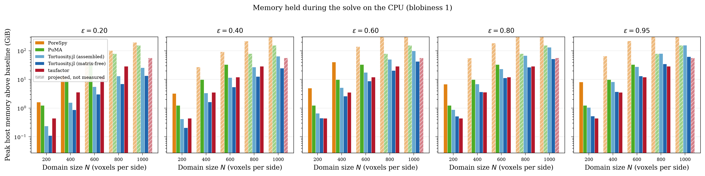
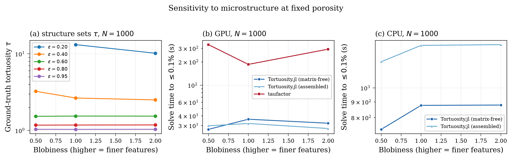

# Performance Benchmarks

This page documents the benchmark campaign that backs the performance claims in the JOSS paper. It carries the detail the paper had to cut for length: the full protocol, the patches each tool needed, the per-case numbers behind every aggregate, and the gaps in the data.

`Tortuosity.jl` is compared against two established image-based tortuosity tools:

- [taufactor](https://github.com/tldr-group/taufactor) — Python/PyTorch, successive over-relaxation (SOR) on the full image grid, CPU and GPU.
- [PuMA](https://github.com/nasa/puma) — C++ with Python bindings (`pumapy`), finite volume with SciPy's conjugate gradient on the full grid, CPU only.

Every number below is traceable to a file under [`benchmarks/results/`](https://github.com/ma-sadeghi/Tortuosity.jl/tree/main/benchmarks/results). Where something is not recorded, this page says so rather than filling the gap.

## Setup

### The image grid

All three tools read the same images, generated once by the `Imaginator` submodule and cached as one HDF5 file per case under `benchmarks/data/images/`, each with a SHA-256 in `manifest.csv` that every stage verifies before it loads.

| axis | values |
|---|---|
| domain size ``N`` | 200, 400, 600, 800, 1000 |
| target porosity ``\varepsilon`` | 0.20, 0.40, 0.60, 0.80, 0.95 |
| blobiness | 0.5, 1.0, 2.0 |

That is 75 combinations, of which **74 are measurable**. `n1000_b050_p020` has no percolating pore space at all — `manifest.csv` records it with zero nodes — so it has no reference and never runs. The same porosity and feature size *do* percolate at ``N = 200``, so this is a finite-size effect rather than a solver failure, and any coverage count at ``1000^3`` is out of 14 rather than 15.

Blobiness is the feature-size knob: `Imaginator.blobs` blurs with ``\sigma = \text{mean(shape)}/40/\text{blobiness}``, so a higher value gives finer features and longer transport paths. Because ``\sigma`` scales with the domain, a ``200^3`` and a ``1000^3`` image at the same blobiness hold the same number of blobs, and the size sweep therefore measures scaling rather than a changing geometry. Porosity alone does not describe a porous medium: at ``N = 600``, ``\varepsilon \approx 0.19`` the coarse structure gives ``\tau = 23.4`` and the fine one ``\tau = 11.2``, a factor of two at the same pore fraction. Three structures are covered so that a ranking between solvers can be shown to survive that. Across the whole grid ``\tau`` runs from 1.028 to 33.93.

Every image is trimmed to the pore space that percolates along the transport axis. This is not cosmetic: an isolated pore cluster contributes nodes no boundary condition reaches, leaving the operator singular on that subspace, and solvers differ in how gracefully they absorb that — so an untrimmed image would measure error handling rather than transport.

### Matched-accuracy protocol

The three tools' convergence parameters measure different quantities, so setting all three to a common value does not produce comparable accuracy: a single-tolerance comparison measures the choice of parameter rather than the solver.

Instead each tool is swept over the knob that best traces *its own* accuracy–time frontier, and the frontiers are compared. We report the wall time of the **fastest measured run that reaches a given relative error in ``\tau``**, at three targets — 10%, 1% and 0.1% — because the margin depends on which one you ask for. Every rung is written to the CSV, so the time to reach any looser target is answerable from the same data without re-measuring.

| tool | knob | range |
|---|---|---|
| Tortuosity.jl | CG iteration count | 18 log-spaced, 1 … 20 000 |
| taufactor | SOR iteration count | 18 log-spaced, 1 … 20 000 |
| PuMA | CG iteration count | 18 log-spaced, 1 … 20 000 |

**Iteration count rather than tolerance, for all three.** `knob_name` is `iters` in every row of every file in `results/timings/`, PuMA included. Tolerance samples the frontier badly at both ends — the loosest settings return ``\tau \approx 0`` and the tightest can step straight past the target in a single rung — and taufactor evaluates its own `conv_crit` only every 100 iterations, which puts the entire coarse-accuracy regime out of reach through that knob.

!!! note "What PuMA needed to reach the same axis"
    Two workarounds, both in `bench_puma.py`. `PropertySolver.solve` raises rather than returning a partial result when SciPy stops on `maxiter`; and it passes only `atol` to SciPy and never `tol`, leaving that at its `1e-5` default, so every tolerance rung below ``10^{-5}\|b\|`` was a duplicate of the one above it. Driving SciPy's conjugate gradient directly, over PuMA's own operator and preconditioner, fixes both. Nothing about PuMA's algorithm changes — only the stopping rule, which is the thing being swept.

### One solve per case, not one per rung

Each tool's whole ladder is traced from a **single** solve. A Krylov or SOR iterate is deterministic — iterate ``k`` is the same vector whether the run stopped there or carried on — so reading tortuosity off at each rung reports exactly what one solve per rung reported, at a fraction of the cost. The time recorded against a rung has the cost of the readings taken so far subtracted back out, so it stays comparable with a plain run that stopped at that iteration.

This was verified rather than assumed, on both devices and all three tools: ``\tau`` comes back bit-identical at every rung, and the traced time lands within a few percent of one-solve-per-rung, converging on it as the rung grows.

Two things this required. `abstol = 0` for `Tortuosity.jl`, because LinearSolve otherwise defaults it to ``\sqrt{\varepsilon_\text{machine}}`` — 3.4e-4 in `Float32` — which ends the solve long before the iteration cap and leaves most of the ladder unreachable. And a `checkpoints` argument on the vendored taufactor fork.

### What the clock covers

**Every tool is clocked from the moment it receives the image to the moment tortuosity can be read.** One rule, applied identically: problem construction, matrix assembly and preconditioner build are all inside the timed region, for all three. Only the image itself, and the tortuosity read-off at the end, sit outside — the first because it is the input, the second because it is instrumentation rather than work a user does.

!!! note "This replaces an earlier, less even convention"
    An earlier version of this benchmark excluded setup for taufactor and PuMA on the grounds that their users pay it before solving, and called the result conservative. It was not conservative by a little. taufactor's `Solver` constructor builds the SOR chequerboard from an ``N^3`` `float64` array and a three-way ``N^3`` meshgrid; measured at ``200^3`` on the GPU it cost **0.415 s against a 0.48 s solve — 45% of the total**, and it grows as ``N^3``. Charging `Tortuosity.jl` for its assembly and coarse space while charging taufactor nothing skewed the GPU comparison by about the whole margin being measured, and inverted the ranking at the loose end of the accuracy ladder.

Each rung is run three times and the **median** reported, with the spread recorded in a `tau_spread` column. A first repeat slower than `repeat_threshold_s` (60 s) abandons the remaining repeats; those rows carry `repeats = 1` and a NaN spread, because a spread of zero is the claim that three runs agreed exactly, which is not the same thing as not having looked.

Both competitors start from a supplied initial guess — taufactor's `init_field` seeds SOR with an exact linear concentration profile — while `Tortuosity.jl`'s CG starts from a zero vector. For a nearly open medium that profile is already close to the answer, so taufactor begins nearly converged and we do not. The current harness has no warm-start option; an earlier experiment that gave CG the same linear start is not reproducible against this code and its result is not reported here.

### Reference solution

Ground truth is a `Tortuosity.jl` **CPU** solve in `Float64` at `reltol = 1e-10`, computed once per image into `results/references.csv` and reused by every tool. Relative error is ``|\tau - \tau_\text{ref}| / \tau_\text{ref}``.

!!! note "Why the reference is not computed on the GPU"
    GPU solves run in `Float32`, whose machine epsilon (≈ 1.2e-7) falls inside the error range being measured, so a `Float32` reference could not resolve the errors it is meant to certify.

!!! note "Why `reltol = 1e-10` specifically"
    `reltol` bounds the *residual*, not the error. For conjugate gradient the solution error is bounded by ``\kappa(A) \cdot \texttt{reltol}``, and a 3D Laplacian on an ``N^3`` grid has ``\kappa \sim N^2``. At ``N = 400`` that is ``\kappa \approx 1.6\times10^5``, so a reference at `reltol = 1e-8` would admit a worst-case solution error near 1.6e-3 — *larger* than the 0.1% target it exists to certify. At `1e-10` the bound sits near 1.6e-5, roughly two orders below the target.

References are the most expensive thing the campaign computes: **51.1 hours over the 74 cases**, with the largest single reference (`n1000_b200_p020`) costing 3.64 h. Each is appended the moment it is solved, so an interruption costs at most one case, and the file survives `--overwrite`, which means "re-measure the timings", not "discard ground truth".

### Matching the discretization, and the taufactor fork

The tools do not discretize the same problem by default. `Tortuosity.jl` and PuMA pin Dirichlet values at the boundary voxels themselves (node-centered, domain length ``(N-1)\Delta x``); released taufactor places the boundaries half a voxel outside the domain and divides by ``N \Delta x``. That is an ``O(1/N)`` discrepancy — 1% at ``N = 100`` — that would otherwise be attributed to the solver.

taufactor is therefore vendored as a git submodule pinned at [`ma-sadeghi/taufactor@a4bc5f9`](https://github.com/ma-sadeghi/taufactor/commit/a4bc5f9), which is `v1.2.1-24-ga4bc5f9`: upstream's own history past the v1.2.1 tag, plus **two patches of ours, 13 lines and 46**. **No solver logic is changed.**

- [`d05aa2e`](https://github.com/ma-sadeghi/taufactor/commit/d05aa2e) (+13 −7) — node-centered Dirichlet BCs at voxels 1 and ``N_x`` with the SOR chequerboard zeroed on those slices; domain length ``(N_x - 1)\Delta x`` to follow; and the convergence criterion honouring the user's `conv_crit` instead of a hard-coded `2e-3` that silently overrides it.
- [`a4bc5f9`](https://github.com/ma-sadeghi/taufactor/commit/a4bc5f9) (+46 −3) — `checkpoints` and `checkpoint_hook` on `solve`, which read ``\tau`` off at a list of iteration counts without stopping and subtract the cost of the readings back out of the clock. This is what lets one solve trace the whole ladder, and it also finalises ``\tau`` when a run stops between the every-100-iteration convergence checks, where upstream would report a stale value. It touches no state the SOR sweep reads, which is why iterate ``k`` comes back bit-identical either way.

### Memory is measured by its own stage

Memory is never read off a timing sweep. The two questions want opposite things from a run: a timing must not be perturbed and so cannot afford a sampler, while a peak needs one and does not care what it costs. The memory stage runs one short fixed-length solve (100 iterations) per case, needs no ground truth, and is cheap.

| | host | device |
|---|---|---|
| Julia | resident set, sampled on an interactive thread | `CUDA.memory_stats().live`, sampled |
| Python | resident set, sampled by `psutil` | `torch.cuda.max_memory_allocated()` |

Host memory is the process resident set in **both** languages, sampled at the same interval, and figures report the *increase* over a baseline taken with the image already loaded. Raw totals would rank runtimes rather than solvers — a Julia process starts near a gigabyte and a Python one near a tenth of that.

**The memory stage runs one process per case, and that is not a tuning choice.** A resident-set increase only means anything in a process that has not already faulted in comparable pages. Measured within one process the readings are worthless: torch's CPU allocator reuses pages it already holds, so an ``80^3`` taufactor solve holding several full-grid tensors reported 0.6 MB, and the series was not even monotonic in domain size.

!!! note "Device memory is what the solve holds, not what the allocator took"
    `CUDA.total_memory() - CUDA.available_memory()` and `torch.cuda.max_memory_reserved()` measure a caching allocator's footprint, which grows opportunistically and saturates at the card's capacity under pressure — reporting the same number for every configuration, precisely where the comparison matters most. Both are recorded for context in `pool_device_bytes` and must not be compared between configurations.

By default the memory stage covers only blobiness 1.0 (`memory.blobinesses` in `config.toml`), because memory tracks pore count, which at a fixed porosity barely moves with the structure.

### Threads

**Nothing is pinned.** Every tool takes the machine the way a user running it would — `-t auto` for Julia, torch's own pool for taufactor, whatever NumPy and SciPy size their BLAS to for PuMA — and every row records the count that run actually got. What the campaign claims is a speedup, not an algorithmic advantage, so a tool that parallelises better is entitled to the result that follows from it, and one that does not is not protected from it.

The counts recorded in `results/environment.csv` are asymmetric, and the asymmetry is real rather than a policy:

| tool | `cpu_threads` recorded |
|---|---|
| Tortuosity.jl | 16 |
| PuMA | 16 |
| taufactor | 8 |

Julia's `-t auto` and SciPy's BLAS both take all 16 logical threads; torch sizes its default pool to the 8 physical cores. **Threads requested are not cores used**, which is why occupancy was sampled separately — see [Core occupancy](#Core-occupancy) below, where the tool taking half as many threads turns out to occupy six times as many cores.

!!! note "An earlier policy pinned everything to one thread, and it was wrong in both directions"
    It forced taufactor and PuMA down to one thread while Julia's OpenBLAS quietly kept eight, and then recorded `cpu_threads = 1` for runs that were nothing of the sort. Nothing on this page was measured that way.

### Hardware and software

The whole dataset comes from one host. `results/environment.csv` records the host per batch, and every row of every result file carries it.

| | |
|---|---|
| host | `pmeal-hpc` |
| GPU | NVIDIA Quadro RTX 8000, 48 GB (the runtime reports 47.268 GiB usable) |
| CPU | 8 physical cores, 16 logical threads |
| Julia | 1.12.6 |
| Python | 3.11.15 |
| PyTorch | 2.10.0+cu128 |
| PuMA (`pumapy`) | 3.2.2 |
| taufactor | fork of v1.2.1, pinned at `a4bc5f9` |

The GPU model comes from the `accelerator` column of `environment.csv`; the core counts from `results/core-occupancy*.json`, which record `host_physical_cores` and `host_logical_cores` directly. **The operating system, the exact CPU model and the host RAM are not recorded anywhere in `results/`.** The largest CPU run in the campaign peaked at 165.4 GB resident, so the machine has at least that much memory, but the campaign does not record the figure itself. The `torch` build recorded (`2.10.0+cu128`) is the Linux wheel from `pixi.lock`; the Windows wheel pinned in the same lockfile is 2.11.0+cu128 and was not used.

## Results

### Summary


Panels (a) and (b) are the GPU: scaling at matched accuracy, and the speedup against taufactor resolved by size and porosity. Panels (c) and (d) are the CPU, where the headline competitor is PuMA. Every panel is drawn at blobiness 1.0, and a blank heatmap cell means one or both tools never reached the target — the CSV carries a `stop_reason` for each.

### Against taufactor on the GPU

Speedup of `Tortuosity.jl` (matrix-free operator with the two-level preconditioner) over taufactor, both on the GPU, at the 0.1% target, at blobiness 1.0 — the same slice the figure draws. Above 1× we are faster.

| Porosity | ``N=200`` | ``N=400`` | ``N=600`` | ``N=800`` | ``N=1000`` |
|---|---|---|---|---|---|
| ε ≈ 0.20 | **38.9×** | **136×** | **155×** | **188×** | — |
| ε ≈ 0.40 | **3.39×** | **17.8×** | **25.9×** | **3.81×** | **32.0×** |
| ε ≈ 0.60 | **1.72×** | **8.19×** | **7.81×** | **20.7×** | **7.29×** |
| ε ≈ 0.80 | **1.26×** | **4.51×** | **6.53×** | **4.61×** | **4.24×** |
| ε ≈ 0.95 | 0.47× | **1.82×** | **3.11×** | **3.10×** | **1.40×** |
| geometric mean | 2.67× | 11.0× | 14.5× | 11.6× | 6.09× |

The dash at ``N = 1000``, ε ≈ 0.20 is not a missing measurement: taufactor gave up after 2349.2 s at 8.61e-3 relative error, while `Tortuosity.jl` reached the target in 72.0 s. Blank cells throughout this page mean one tool never got there, never that the run was not attempted.

Pooling all three microstructures rather than one gives 70 paired cases at the 0.1% target and a **pooled geometric mean of 6.55×**, ranging from 0.39× to 188×:

| | ``N=200`` | ``N=400`` | ``N=600`` | ``N=800`` | ``N=1000`` | row |
|---|---|---|---|---|---|---|
| ε ≈ 0.20 | 29.4× | 53.5× | 83.8× | 128× | 58.7× | **58.3×** |
| ε ≈ 0.40 | 2.66× | 11.2× | 14.3× | 12.7× | 28.5× | **10.2×** |
| ε ≈ 0.60 | 1.44× | 6.72× | 10.4× | 13.9× | 13.3× | **7.13×** |
| ε ≈ 0.80 | 0.69× | 2.77× | 6.14× | 4.18× | 4.86× | **2.99×** |
| ε ≈ 0.95 | 0.47× | 1.64× | 3.19× | 3.18× | 2.17× | **1.76×** |
| column | **2.05×** | **7.12×** | **10.4×** | **10.6×** | **8.44×** | **6.55×** |

Two things are worth reading off this beyond the headline.

**Porosity moves the result more than size does.** The margin is set by how much solid there is to exclude and falls monotonically with porosity at every size — from 58× near ε ≈ 0.2 to 1.8× at ε ≈ 0.95. At ``N = 600``, ε ≈ 0.19 taufactor needs its entire 20 000-sweep budget and 867.9 s to reach the target, against 189 preconditioned CG iterations and 5.6 s.

**The size trend rises steeply and then plateaus; it does not keep widening.** The column means above mix a changing case set as taufactor drops out, so they overstate the trend. On a fixed set of 12 microstructure/porosity families that both tools solve at *every* size:

| | ``N=200`` | ``N=400`` | ``N=600`` | ``N=800`` | ``N=1000`` |
|---|---|---|---|---|---|
| geometric mean | 1.11× | 4.57× | 8.18× | 7.52× | 8.44× |
| worst case | 0.39× | 1.55× | 2.53× | 2.51× | 1.40× |
| best case | 13.4× | 18.4× | 45.2× | 87.9× | 58.6× |

That fixed set is a stricter subset than the pooled table, because a family has to pair at ``1000^3`` as well, which excludes the low-porosity families where the margin is largest. Both are honest; only this one supports a five-size scaling claim. The margin rises to about 8× by ``600^3`` and holds. Meanwhile the **spread keeps opening** while the mean stays flat, so the geometric mean alone hides the shape.

!!! note "Restricting to cases both tools solve biases against us"
    A speedup ratio needs both tools to have produced an answer, and the cases taufactor cannot finish are exactly the ones we win biggest. Four such cases exist at the 0.1% target and appear in no speedup figure: `n600_b050_p020` (taufactor exhausted its ladder at 868.3 s and 1.52e-3 error; ours 2.66 s), `n800_b050_p020` (2060.4 s, 1.75e-3; ours 9.41 s), `n1000_b050_p040` (timed out at 2351.8 s, 2.18e-3; ours 20.6 s) and `n1000_b100_p020` (2349.2 s, 8.61e-3; ours 72.0 s). As lower bounds those are 326×, 219×, 114× and 33×, and in each one taufactor never produced the answer at all.

    There are no cases in the other direction: `Tortuosity.jl` reaches the 0.1% target on all 74 GPU cases (`stop_reason = target_reached` in every row of `results/timings/tortuosity-gpu-matrixfree.csv`).

### How much the answer depends on the accuracy you ask for

Reporting a single accuracy target flatters whichever solver happens to suit it. Resolving the same data at three targets shows that the ranking **does not invert** — demanding more accuracy widens the margin without reversing it:

| target | paired cases | pooled geometric mean | cases taufactor wins | where |
|---|---|---|---|---|
| 10% | 74 | 4.19× | 10 | all at ``N = 200`` |
| 1% | 74 | 5.20× | 10 | all at ``N = 200`` |
| 0.1% | 70 | 6.55× | 7 | all at ``N = 200`` |

(GPU, all five sizes, all three microstructures.) The case count drops to 70 at the tightest target because that is where taufactor's four failures land; those four are dropped from the mean rather than counted as wins.

taufactor is faster **only** at ``N = 200``, on 10 of 74 paired cases at the loosest target and 7 of 70 at the tightest, always at ε ≥ 0.4. Its worst-case-for-us cell is `n200_b200_p095`, where 6 SOR sweeps and 0.381 s beat 59 CG iterations and 0.976 s — 0.39×.

Both ends have a mechanism. taufactor's SOR starts from a linear concentration profile, which for an open medium is already close to the answer, so when little accuracy is demanded it has little left to do; `Tortuosity.jl` meanwhile pays a fixed setup cost — assembling the operator and building the coarse space — that is charged even to a solve which then runs for one iteration. At ``200^3`` that fixed cost is a large fraction of a sub-second solve. As the image grows, or the target tightens, the convergence rate of the method decides the outcome, which is where a Krylov method separates from a stationary one.


Each curve traces one tool's ladder from loose (fast, inaccurate) to tight, one panel per domain size. The vertical position at a given time is what the matched-accuracy protocol samples. The CPU equivalent is `docs/src/assets/benchmark_pareto_cpu.png`.


Each panel is one domain size at one accuracy target, with one bar per porosity, so the spread an aggregate would hide stays visible.

### Against taufactor on the CPU

Both tools also run on the CPU, where the margin is smaller and the sign flips at high porosity:

| | ``N=200`` | ``N=400`` | ``N=600`` | ``N=800`` | row |
|---|---|---|---|---|---|
| ε ≈ 0.20 | 20.8× | 55.9× | 87.4× | — | **43.1×** |
| ε ≈ 0.40 | 1.91× | 6.28× | 10.4× | 8.43× | **5.69×** |
| ε ≈ 0.60 | 0.87× | 5.32× | 8.61× | 10.3× | **4.50×** |
| ε ≈ 0.80 | 0.23× | 1.65× | 3.75× | 2.07× | **1.31×** |
| ε ≈ 0.95 | 0.11× | 0.49× | 1.26× | 1.23× | **0.53×** |
| column | **0.97×** | **4.33×** | **6.91×** | **3.85×** | **3.18×** |

Pooled over all three microstructures, 56 paired cases, geometric mean 3.18×, ranging 0.041× to 157×. taufactor is faster in 14 of them, all at ε ≥ 0.4 and all at ``N \le 800``; at ε ≈ 0.95 it is faster on average at every size below ``600^3``. See `docs/src/assets/benchmark_speedup_taufactor_cpu.png` and `docs/src/assets/benchmark_scaling_cpu.png`.

!!! warning "The taufactor CPU dataset has two gaps, and they are not results"
    There is **no taufactor CPU data at ``1000^3``**, and none at ``800^3`` for ε ≈ 0.2. The ``800^3`` cases were excluded from the sweep that ran and the follow-up never happened — a sequencing gap, not a decision. Filling it was judged not worth the machine time: the worst ``600^3`` CPU case took 6.02 h and exhausted its ladder without reaching the target, and ``800^3`` projects to roughly 19 h per case. The memory figure projects taufactor's ``1000^3`` CPU footprint from its flat 60.0 bytes per voxel and labels the bar as projected; a *time* projection is not defensible the same way, because taufactor's sweep count to target is not monotonic in size.

### Against our own CPU path

On the GPU the solver is **20.6× faster than its own CPU path**, geometric mean over all 74 cases, ranging 6.6× to 33.5×:

| | ``N=200`` | ``N=400`` | ``N=600`` | ``N=800`` | ``N=1000`` |
|---|---|---|---|---|---|
| GPU over CPU | 10.1× | 20.0× | 25.6× | 27.7× | 26.2× |

The ratio rises with size and then holds near 27×, which is what a device with a fixed launch overhead and a large bandwidth advantage should do.

### Against PuMA


PuMA's finite-volume solver is CPU-only, so it is compared against the `Tortuosity.jl` CPU path. Where both reach the target — **all 15 cases at ``N = 200``** — `Tortuosity.jl` is faster in every one, by a geometric mean of **31.1×**, ranging 2.1× to 388×. At blobiness 1.0:

| Porosity | `Tortuosity.jl` (CPU) | PuMA | speedup |
|---|---|---|---|
| ε ≈ 0.19 | 4.84 s | 1141.3 s | **236×** |
| ε ≈ 0.40 | 3.14 s | 351.4 s | **112×** |
| ε ≈ 0.60 | 7.36 s | 198.5 s | **27.0×** |
| ε ≈ 0.80 | 5.32 s | 112.5 s | **21.1×** |
| ε ≈ 0.95 | 10.4 s | 36.3 s | **3.5×** |

**PuMA was not run above ``200^3``, by decision rather than by failure.** A single ``200^3`` case costs it up to 19 minutes, and the larger sizes were prohibitive. `results/timings/puma-cpu.csv` contains ``200^3`` only; the blanks in the PuMA panels are cases nobody attempted, and this page does not present them as a solver that tried and missed.

### Core occupancy

Neither CPU tool saturates the machine, and the margin above is not won by taking more of it. Occupancy was sampled on the benchmark host with `psutil.cpu_percent` over the process tree, with the first and last 20% of samples trimmed so that compilation and teardown are excluded. Raw data in `results/core-occupancy.json` and `results/core-occupancy-ours.json`.

| tool | case | median cores | mean | peak | usable samples |
|---|---|---|---|---|---|
| PuMA | `n200_b100_p040` | **6.39** | 5.82 | 6.86 | 429 |
| Tortuosity.jl (CPU, matrix-free) | `n200_b100_p040` | **1.00** | 2.64 | 15.97 | 279 |
| Tortuosity.jl (CPU, matrix-free) | `n600_b100_p040` | **5.48** | 6.79 | 15.78 | 168 |

Of 8 physical cores (16 logical). PuMA occupies most of the machine throughout its solve. Our own occupancy is size-dependent: at ``200^3`` a solve finishes in seconds and the median sample catches serial setup rather than the threaded apply, while at ``600^3``, where the solve dominates, the median rises to 5.5 cores with peaks using every logical thread. So the PuMA comparison at ``200^3`` is won on **less** of the machine, not more.

!!! warning "The paired run does not measure our side, and its number is not used"
    `core-occupancy.json` ran both tools in one pass, but our process there recorded `"exit": -11` (SIGSEGV during exit cleanup, after the solve completed and the row was written) with only **6 usable samples**. Six samples is not a measurement, and the 1.39 median it reports for `tortuosity-cpu-matrixfree` should not be quoted. The `Tortuosity.jl` figures above come from the separate `core-occupancy-ours.json` run, which sampled ten times a second at ``200^3`` and added a ``600^3`` case where the solve dominates outright. Both scripts back up the published result files, restore them afterwards, and verify the restore by SHA-256 — `published_results_unchanged: true` in each JSON.

### Memory


Peak device memory, blobiness 1.0, in GB. **The figure plots `results/memory/*.csv`, which is the shipped path — the `Float32` solve *plus* the `Float64` refinement pass that `solve` applies by default.** `results/archive/pre-refine-2026-08-20/` holds the same cases measured before refinement was added, and both are given here because the two answer different questions: what the operator costs, and what a user pays.

| ``N`` | | ε ≈ 0.20 | 0.40 | 0.60 | 0.80 | 0.95 | taufactor |
|---|---|---|---|---|---|---|---|
| 200 | matrix-free, solve only | 0.081 | 0.128 | 0.177 | 0.225 | 0.260 | 0.227 |
| | matrix-free, as shipped | 0.101 | 0.192 | 0.274 | 0.354 | 0.412 | |
| | assembled, as shipped | 0.197 | 0.340 | 0.519 | 0.698 | 0.829 | |
| 400 | matrix-free, solve only | 0.632 | 1.065 | 1.491 | 1.911 | 2.205 | 1.801 |
| | matrix-free, as shipped | 0.867 | 1.570 | 2.262 | 2.945 | 3.422 | |
| | assembled, as shipped | 1.285 | 2.780 | 4.268 | 5.746 | 6.788 | |
| 600 | matrix-free, solve only | 2.152 | 3.632 | 5.023 | 6.403 | 7.440 | 6.068 |
| | matrix-free, as shipped | 2.956 | 5.360 | 7.620 | 9.862 | 11.547 | |
| | assembled, as shipped | 4.430 | 9.566 | 14.424 | 19.269 | 22.932 | |
| 800 | matrix-free, solve only | 5.089 | 8.521 | 11.876 | 15.212 | 17.658 | 14.375 |
| | matrix-free, as shipped | 6.988 | 12.562 | 18.013 | 23.432 | 27.407 | |
| | assembled, as shipped | 10.499 | 22.424 | 43.852 | *oom* | *oom* | |
| 1000 | matrix-free, solve only | 9.900 | 16.660 | 23.275 | 29.788 | 34.443 | 28.057 |
| | matrix-free, as shipped | 13.584 | 24.565 | 35.312 | 45.892 | 49.653 | |
| | assembled, as shipped | 20.421 | 48.506 | *oom* | *oom* | *oom* | |

**The matrix-free footprint is a two-term model, and it is exact.** Fitted by least squares on the five ``800^3`` solve-only points: **32.02 bytes per pore node plus 4.00 bytes per grid voxel**. Extrapolated to ``1000^3`` it reproduces all five measured points to within 0.013%, and the worst residual anywhere at ``N \ge 400`` is 0.09%. The two terms are the mechanism written down: 4 bytes per *voxel* is the `Int32` index map over the grid, and 32 bytes per *pore node* is the Krylov workspace and preconditioner, which both operator forms share. (``200^3`` sits about 5% off the model, which is allocation granularity at a footprint of a few hundred megabytes.)

Refinement adds a flat **20.0 bytes per pore node**, giving 52 B/node + 4 B/voxel for the shipped path, measured at 23 of the 25 matrix-free cases. The two exceptions are the guard doing its job: at ``1000^3``, ε ≈ 0.95 it fires at the third allocation and the delta is 16 B/node, and for the assembled operator at ``1000^3``, ε ≈ 0.40 it fires at the first, leaving the peak completely unmoved.

**Operator ratios.** Over the 20 cases where both operators complete:

| basis | geometric mean | range |
|---|---|---|
| as shipped (solve + refinement) | **1.84×** | 1.48× – 2.43× |
| solve only | **2.32×** | 1.73× – 3.18× |

The two differ because refinement's 20 B/node is charged to *both* operators and is common to them, so including it pushes the ratio toward 1. Ratios are the robust quantity here: any workspace both forms share is conservative, and a common scale error cancels.

!!! note "The assembled operator's per-node cost has two regimes, and the data shows the step"
    `src/assembly.jl` picks the index type from `7 * nnodes + 1 <= typemax(Int32) ? Int32 : Int`, so the assembled operator widens its offsets to 64 bits above 306 783 378 pore nodes. Measured cost per pore node (solve only): **91.0 B/node** below that bound and **122.8 B/node** above it, a step of about 32 B/node, which is 4 extra bytes on each of roughly seven nonzeros per row.

    The campaign crosses the bound by a hair. `n800_b100_p060` has 306 846 383 nodes — 0.02% over — and reports 122.9 B/node against 91.0 at the porosity below it. `n1000_b100_p040`, at 395 M nodes, reports 122.7. **The package widens rather than refusing:** an earlier version of this page claimed the operator could not be built past ``3\times10^8`` pore voxels and that the package rejected the problem. That has not been true since commit `ab63e7f`; the cost is memory, not a hard ceiling.

**Against taufactor.** taufactor holds dense arrays over the whole grid, so its device footprint is flat in porosity: at ``1000^3`` all five porosities report the identical 28 056 869 888 bytes, and the per-voxel figure converges from 28.43 B/voxel at ``200^3`` to 28.06 at ``1000^3``. The comparison therefore turns entirely on our side of the ledger. As shipped, `Tortuosity.jl` uses less device memory at the **two lowest porosities and more at the three highest, at every size**. On the solve alone it is four of five at ``200^3`` and three of five from ``400^3`` up. The porosities where refinement costs the comparison are exactly the porosities where it buys nothing: the campaign's worst GPU error at ε ≈ 0.6 is 7.9e-4 and at ε ≈ 0.95 is 5.8e-4, both inside the 0.1% target with no refinement at all.

**The ceiling.** The matrix-free operator completes every ``1000^3`` case on the 48 GB card, but not with much to spare: at ε ≈ 0.95 it peaks at 49.653 GB, which is 46.24 of the 47.268 GiB the runtime reports — 97.9% — and that is the case where the refinement guard fires. The assembled operator runs out above ε ≈ 0.8 at ``800^3`` and above ε ≈ 0.4 at ``1000^3``. Those `oom` rows are results, not gaps.



On the host the same structure holds with more headroom: at ``1000^3``, ε ≈ 0.95 the assembled path peaks at 163.6 GB above baseline against 53.8 GB matrix-free, a factor of 3.0. taufactor's CPU footprint is a flat 60.0 bytes per voxel across all four sizes it was measured at, which is what the ``1000^3`` projection in the figure rests on; PuMA's is a flat 1.34 GB at ``200^3``, independent of porosity.

### What the operator and the preconditioner are worth

The tables above are measured with both enabled, because that is what `solve(sim)` selects for images this size. They contribute in quite different ways.

**The operator buys memory, not speed.** Holding everything else fixed and switching only the operator, matrix-free is **1.14×** faster end to end on the GPU (geometric mean over 59 paired cases) and **1.34×** on the CPU (74 cases). Its apply is considerably faster in isolation, but a solve also pays for preconditioner setup and the coarse solve, which are common to both paths, so the advantage dilutes. On the CPU it grows with size — 0.96× at ``200^3`` to 1.60× at ``1000^3`` — which is the same dilution running the other way as the solve stops being dominated by fixed costs. What does not dilute is the 1.8×–2.3× memory ratio above, and the 20 cases where the assembled operator simply does not fit.

**The preconditioner buys iterations.** Measured directly at a fixed relative residual of 1e-6, on the CPU in `Float64`, matrix-free, blobiness 1.0, over the cached campaign images (`results/iteration-counts-2026-08-21.log`). Iteration counts are deterministic given the image and the code, so this needs no quiet machine and reproduces exactly.

| ε | | ``200^3`` | ``400^3`` | ``600^3`` | ``800^3`` | ``1000^3`` |
|---|---|---|---|---|---|---|
| 0.20 | preconditioned | 136 | 132 | 177 | 191 | **205** |
| | unpreconditioned | 2721 | 4958 | 7099 | — | — |
| 0.40 | preconditioned | 119 | 123 | 114 | 135 | **139** |
| | unpreconditioned | 1219 | 2465 | 3549 | — | — |
| 0.60 | preconditioned | 83 | 89 | 108 | 115 | **134** |
| | unpreconditioned | 989 | 1864 | 2708 | — | — |
| 0.80 | preconditioned | 86 | 80 | 88 | 98 | **110** |
| | unpreconditioned | 850 | 1515 | 2338 | — | — |
| 0.95 | preconditioned | 58 | 62 | 72 | 89 | **87** |
| | unpreconditioned | 747 | 1377 | 1980 | — | — |

The unpreconditioned solve is capped at ``600^3``: it costs thousands of iterations over hundreds of millions of nodes, and three sizes already establish its rate beyond doubt.

Over the identical ``200^3 \to 600^3`` range, geometric mean across the five porosities:

| | growth over 3× edge | exponent |
|---|---|---|
| unpreconditioned | 2.730× | ``L^{0.914}`` |
| preconditioned | 1.156× | ``L^{0.132}`` |

**The preconditioned count is not mesh-independent — it grows, but about seven times more slowly in the exponent.** Extending the preconditioned series to ``1000^3`` gives 1.404× over a 5× edge, or ``L^{0.211}``; the exponent creeps up when the larger sizes are included and is stable there rather than accelerating. The growth rate is not ordered by porosity (per-porosity exponents over ``200^3 \to 1000^3`` run 0.255, 0.097, 0.298, 0.153, 0.252); what *is* ordered by porosity is the absolute count.

The honest headline is therefore not a flat count but a widening benefit — geometric mean of the unpreconditioned-to-preconditioned iteration ratio:

| | ``200^3`` | ``400^3`` | ``600^3`` |
|---|---|---|---|
| fewer iterations | **12.5×** | **23.1×** | **29.6×** |

!!! note "Iterations to a residual and rungs to the accuracy target are different questions"
    The sweep reports the rung at which a case first meets the 0.1% ``\tau`` target, which at low porosity grows faster than the iteration count does — 5.7× from ``200^3`` to ``1000^3`` at ε ≈ 0.2, against 1.51× for iterations to a fixed residual. The difference is the amplification from residual to tortuosity error, which the conditioning sets: measured at 758× at ε ≈ 0.16 against 12–33× elsewhere. A larger low-porosity image needs a smaller residual to hit the same ``\tau`` target, and so more iterations, while the solver's convergence rate has not degraded at all. Both effects are real and the amplification is the larger of the two.

### Microstructure



The left panel establishes that the three blobiness values really are different problems: at ``N = 1000``, low porosity, the coarse and fine structures differ in ``\tau`` by a factor that grows as the medium closes up. The remaining panels ask whether the ranking between solvers survives that. It does — the margin against taufactor is smaller on the finest structure at every porosity (pooled geometric means at the 0.1% target: 7.23× at blobiness 0.5, 7.95× at 1.0, 5.00× at 2.0) but never changes sign except in the ``200^3`` cells already noted.

### Cross-code agreement

The reference is our own code, which is the weakest link in the accuracy chain, so it is worth stating what the independent implementations say about it. Across the campaign, **taufactor reproduces our reference ``\tau`` to within the 0.1% target on 126 of 131 (tool, case) sweeps** — 70 of 74 on the GPU and 56 of 57 on the CPU — and **PuMA on 15 of 15**. The five that miss are the ladder-exhausted and timed-out cases listed above, where taufactor stopped short of the target rather than disagreeing with it. Where a tool's ladder overshoots the threshold rather than landing on it, agreement tightens to a few parts in ``10^6``, including on the most tortuous image in the set (ε ≈ 0.16, ``\tau = 33.9``).

## Limitations

**The GPU result is reproducible run to run, but not guaranteed bit-for-bit.** The two-level preconditioner used to accumulate its restriction with atomic floating-point additions, whose order is not fixed between launches; a float sum is not associative, so the same image at the same tolerance returned a slightly different ``\tau`` on every run — by roughly the size of the accuracy target on the most ill-conditioned images. That has been fixed. `_restrict!` now **gathers over a fixed coarse-to-fine adjacency** built once at setup (`Aggregation` in `src/preconditioner.jl`), which needs no atomic and fixes the summation order, paying for the ordering once instead of on every CG iteration.

The campaign data shows the fix took: across `results/timings/tortuosity-gpu-matrixfree.csv`, **all 621 of the 621 rows measured with three repeats record `tau_spread` of exactly 0** — three GPU runs of the same configuration returning the identical ``\tau`` to every recorded digit. The same holds for all 496 three-repeat rows of the assembled GPU file. (The remaining rows carry `repeats = 1` because the first repeat exceeded the 60 s threshold, and a NaN spread rather than a zero, which is the honest record of not having looked.)

What remains is narrower: **atomic additions are still used to assemble the Galerkin coarse operator** (`_coarse_stencil_kernel!`, which forms ``W^\top A W`` in one pass over the stored entries). That runs once per solve at setup, not once per iteration, but it means bit-for-bit equality across runs is still not guaranteed. Use the CPU `Float64` path when an exactly reproducible number is required; it shows zero spread throughout.

**The CPU comparison is close to core-matched, and the residual asymmetry favours PuMA.** See [Core occupancy](#Core-occupancy): PuMA occupies a median 6.4 of 8 physical cores, our median at the same case is 1.0. This removes a doubt rather than raising one, but it does mean the two tools are not doing the same thing with the machine.

**PuMA appears at one size only.** ``200^3``, by decision — a single case there costs it up to 19 minutes and the larger sizes were prohibitive. The larger images were not attempted and are not reported as failures.

**taufactor's CPU dataset is incomplete** at ``1000^3`` (absent) and at ``800^3``, ε ≈ 0.2 (absent). The GPU dataset is complete over all 74 cases.

**The reference is computed by this package.** Every accuracy figure on this page is stated against a `Tortuosity.jl` `Float64` CPU solve. The cross-code agreement above is what stands in for an independent oracle; it is not the same thing as one.

**One machine, one image generator.** Timings are only comparable within one machine and one software stack, and the whole dataset comes from `pmeal-hpc`. The images are synthetic blobs from a single generator rather than tomography, so the porosity and feature-size axes are controlled but the geometry is not a sample of any real material.

**The accuracy ladder cannot resolve margins below about 2×.** Rungs sit about 1.8× apart in iteration count, so a difference smaller than one rung is invisible to this protocol, and a case that lands just past a rung boundary can show a step change that is an artifact of the sampling rather than of the solver.

## Reproducing

The benchmark harness, environment specification, and raw CSV results live in [`benchmarks/`](https://github.com/ma-sadeghi/Tortuosity.jl/tree/main/benchmarks). Python dependencies (PuMA, PyTorch, the taufactor fork) are pinned with [pixi](https://pixi.sh); the taufactor fork is vendored as a git submodule under `vendor/`. Read `benchmarks/README.md` before changing anything, and `benchmarks/run/ORCHESTRATION.md` before driving a campaign on a rented machine.

```bash
git clone --recurse-submodules https://github.com/ma-sadeghi/Tortuosity.jl.git
cd Tortuosity.jl/benchmarks

# Resolve both environments and prove the machine works before anything is
# measured: Julia and CUDA versions, the device name, torch's CUDA availability,
# and that taufactor and pumapy both import with the patched signatures present.
./run/setup.sh

# The same 75 cases, the same stages, every dimension divided by ten. Minutes,
# not hours. Run it before committing a large machine to anything.
./run/campaign.sh --grid=smoke

# The expensive, irreplaceable half: ground truth, on its own, first. Every later
# stage depends on these values and nothing else does.
./run/campaign.sh --grid=full --stages=images,references

# Measurement. Fourteen stages, serially, cheapest case first.
./run/campaign.sh --grid=full --stages=timings,memory

# Post-processing. Reads results/ and nothing else — no images, no solver, no GPU.
./run/figures.sh
```

Each stage can also be run on its own, which is how a campaign is split over several sittings:

```bash
julia --project=. generate_images.jl --grid=full
julia --project=. -t auto compute_references.jl --grid=full
julia --project=. -t auto bench_tortuosity.jl --device=gpu --operator=matrixfree --measure=time
julia --project=. -t auto,1 bench_tortuosity.jl --device=cpu --operator=assembled --measure=memory
pixi run python bench_taufactor.py --device=cuda --measure=time
pixi run python bench_puma.py --measure=memory
pixi run python make_figures.py --only=memory,summary
```

Every stage takes the same selection flags — `--grid=`, `--sizes=`, `--porosities=`, `--blobiness=`, `--cases=`, `--overwrite`, `--dry-run`. They compose, `--cases=` overrides the rest, and an unrecognised flag is an error rather than something quietly ignored. `./run/campaign.sh` additionally takes `--stages=`, `--tools=` and `--devices=`.

Every stage resumes from its own results file, so an interrupted campaign is re-run with the same command. A sweep counts as complete only once one of its rows carries a `stop_reason` (`target_reached`, `timeout`, `ladder_exhausted`, `error` or `oom`); resume keys on that rather than on the mere presence of a row, because a case interrupted halfway up its ladder is indistinguishable from a converged one once it is in the file.

!!! warning "Run the stages serially, and the CPU and GPU passes in separate processes"
    The stages contend for the same GPU and the same cores, and concurrency contaminates the very timings the benchmark exists to measure. `campaign.sh` takes a PID lock and refuses to start beside a live campaign, but that only catches the obvious case.

    Separate processes matter for a second reason: a process that has already run large `Float64` CPU sweeps carries a multi-gigabyte Julia heap, and GPU sweeps that follow it in the same process stop being monotonic in the iteration count — a longer solve comes back faster, which is not something a solver can do.

!!! warning "Do not pin a stage to fewer threads than the machine has"
    Every tool takes the whole machine, which is what a user running it gets, and every row records what it actually got. Pinning one tool and not another is how the earlier campaign came to record `cpu_threads = 1` for runs where OpenBLAS was quietly using eight.

Expect, and do not treat as failures: `oom` rows from the assembled operator and from taufactor at the largest sizes; `timeout` rows from PuMA; and blank cells in a figure. Every one has a `stop_reason` in the CSV explaining it.
