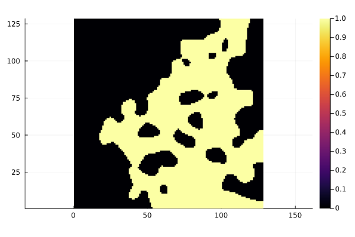

# Theory

## What is tortuosity

A voxel image is a 2D or 3D array of 0s and 1s, which denote solid and void respectively (see figure below).



The tortuosity factor is a geometric property of the medium. It is loosely defined as the extra length that molecules travel on average, by diffusion, between opposing faces such as $x=0$ and $x=\ell_x$, normalized by the direct length $\ell_x$. It is therefore direction-dependent, and can be computed along each of the main principal axes of the image.

With this definition, open space has a tortuosity factor of 1, while a maze has one equal to the length of the maze divided by the direct length.

## Computing tortuosity

To compute $\tau$, solve the steady state heat equation, that is, the Laplace equation:

```math
\nabla \cdot (D_b \nabla c) = 0
```

where $c$ is the concentration field and $D_b$ the bulk diffusivity. Solve it on a voxel image with Dirichlet boundary conditions imposed on opposing faces, for example $c(x=0) = c_i$ and $c(x=\ell_x) = c_o$. The tortuosity factor, $\tau$, is then defined as:

```math
\tau = \frac{D_b}{D_{eff}} \varepsilon
```

where $\varepsilon$ is the porosity and $D_{eff}$ is the effective diffusivity, computed as:

```math
D_{eff} = \frac{\dot{m} \cdot \ell_x}{\Delta c \cdot A}
```

where $\dot{m}$ is the mass flow rate, $\Delta c$ is the concentration difference, and $A$ is the cross-sectional area.

Tortuosity.jl carries out these steps for you; [Steady-State Tortuosity](@ref) walks through them on a generated image.
